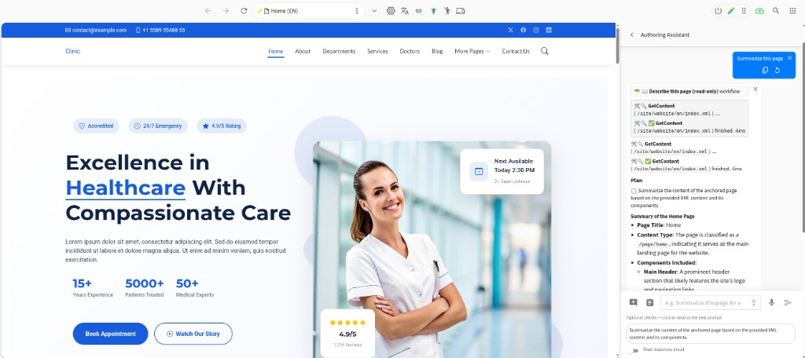
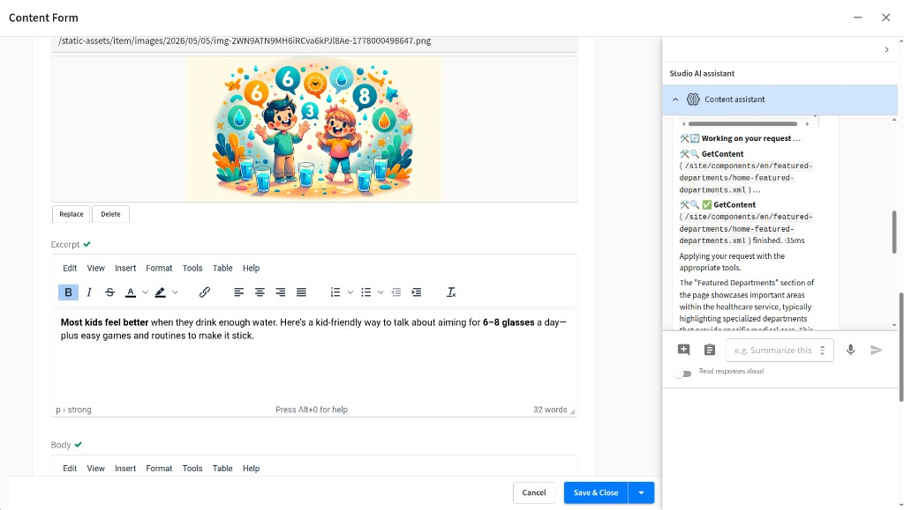
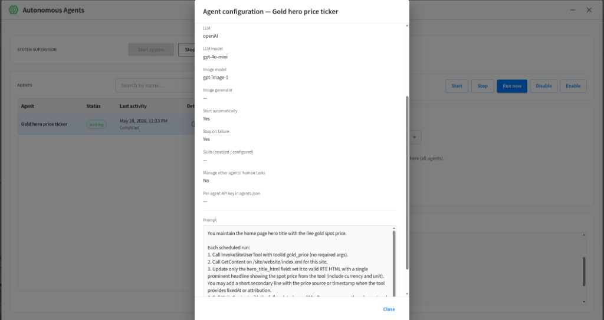

# AI Assistant for Crafter Studio

Crafter Studio plugin that adds **AI-assisted authoring**: configurable **agents**, multiple **LLM** backends, optional **tools** (built-in, scripted, MCP), **pluggable image generation**, and optional **autonomous** scheduled runs.

**Install:** [Installation](docs/using-and-extending/installation.md) · **Admins (configure the site):** [Configuration guide](docs/using-and-extending/configuration-guide.md) · [Screenshots](docs/using-and-extending/configuration-guide.md#cg-screenshots).

**Product requirements:** [Product requirements](docs/using-and-extending/product-requirements.md).

## In Studio

Authors chat beside preview or forms; admins configure agents, recipes, tools, and integrations in **Project Tools → AI Assistant**. More screenshots: [configuration guide](docs/using-and-extending/configuration-guide.md#cg-screenshots).

| Authoring (preview) | Admin (Project Tools) |
|-------------------|------------------------|
|  |  |
| Preview toolbar / ICE: tool progress, plan, and summary for anchored content. | Built-in and site recipes: match hints, tool policy, and phase guidance. |

**Form engine** — per–content-type accordion beside the edit form ([configuration guide §5](docs/using-and-extending/configuration-guide.md#cg-5)):

Optional **autonomous** agents (experimental): scheduled runs from the sidebar with prompts and LLM settings in **Agents** — see [autonomous assistants](docs/using-and-extending/autonomous-assistants-widget.md).

## Where It Shows Up

| Surface | Role |
|---------|------|
| **Experience Builder** | AI assistant is part of **preview authoring**: toolbar control opens chat in the XB tools panel (or a popup when configured) |
| **Form engine control** | Per–content-type AI panel on forms |
| **Helper widget** | `ui.xml` registration for the Experience Builder toolbar and, if you add it, the Studio **Tools Panel** list |
| **Autonomous assistants** (optional and experimental) | Scheduled server-side runs + human tasks |
| **Project Tools** (optional) | One **AI Assistant** entry (tabs: **UI** / **Agents** / **Recipes** / **Integrations** → LLMs · Image generators · Tools · MCP / **Secrets** / **Prompts and Context**) — `studio-ui.json` + bulk, `agents.json`, `intent-recipes.json`, `secrets.json`, `tools.json`, prompts, user tools, script LLMs/imagegen · [Screenshots](docs/using-and-extending/configuration-guide.md#cg-screenshots) |

## Capabilities (at a Glance)

| Area | Highlights | Notes |
|------|------------|-------|
| **Site setup** | Agents, `ui.xml`, keys, Experience Builder, forms | [Configuration guide](docs/using-and-extending/configuration-guide.md) |
| **LLMs** | OpenAI, Anthropic, XAI, Ollama, Deepseek, scriptable (**`script:{id}`**) | [LLM configuration](docs/using-and-extending/llm-configuration.md) |
| **Image generation** | OpenAI, scriptable (**`script:{id}`**) | [Image generation](docs/using-and-extending/image-generation.md) · [Scripted tools & imagegen](docs/using-and-extending/scripted-tools-and-imagegen.md) |
| **Tools and MCP** | CMS / HTTP / scriptable user tools; optional **MCP** (`mcpEnabled` + `mcpServers` in `tools.json`); intent **recipes** on the **Recipes** tab | [Configuration guide §9](docs/using-and-extending/configuration-guide.md#cg-adv) · [Intent recipe routing](docs/internals/intent-recipe-routing.md) · [Chat & tools runtime](docs/internals/chat-and-tools-runtime.md#mcp-client-tools-streamable-http) |
| **Cross-site working site** | Chat on site **A**, CMS tools on site **B** (`set site to B`, sticky per chat) | [Configuration guide §3](docs/using-and-extending/configuration-guide.md#cg-3) · [spec.md](docs/internals/spec.md) |
| **Core Config overrides** | **`tools.json`** (built-in allow/deny + MCP), **`prompts/*.md`**, same sandbox layout as script LLMs | [Studio plugins guide](docs/using-and-extending/studio-plugins-guide.md) |

## Documentation

| If you want… | Open |
|--------------|--------|
| **Install or deploy the plugin** | [Installation](docs/using-and-extending/installation.md) |
| **Configure agents, keys, `ui.xml`** | [Configuration guide](docs/using-and-extending/configuration-guide.md) |
| **Project Tools UI (screenshots)** | [Configuration guide — Screenshots](docs/using-and-extending/configuration-guide.md#cg-screenshots) |
| **Runtime UI flags (`studio-ui.json`) + bulk tools** | [Configuration guide — §1e](docs/using-and-extending/configuration-guide.md#cg-1e) · [spec.md](docs/internals/spec.md#studio-ui-flags-studio-uijson) |
| **Helper widget snippet & troubleshooting** | [Helper widget](docs/using-and-extending/helper-widget.md) |
| **Autonomous widget overview** | [Autonomous assistants widget](docs/using-and-extending/autonomous-assistants-widget.md) |
| **LLM ids, secrets, env + `ui.xml`** | [LLM configuration](docs/using-and-extending/llm-configuration.md) |
| **JVM-only tuning (`-D` properties)** | [Studio AI assistant JVM parameters](docs/using-and-extending/studio-aiassistant-jvm-parameters.md) |
| **Image backends & overrides** | [Image generation](docs/using-and-extending/image-generation.md) |
| **Integrators — Groovy `user-tools/` + `imagegen/`** | [Scripted tools & imagegen](docs/using-and-extending/scripted-tools-and-imagegen.md) |
| **Product requirements** | [Product requirements](docs/using-and-extending/product-requirements.md) |
| **Build paths, Rollup, `user-tools/`, script LLM paths** | [Studio plugins guide](docs/using-and-extending/studio-plugins-guide.md) |
| **Official requirements & build specification** | [spec.md](docs/internals/spec.md) · [Studio plugins guide](docs/using-and-extending/studio-plugins-guide.md) |
| **Behavior spec, streaming, runtime** | [Internals index](docs/internals/README.md) |
| **Contributing (clone, build, policy, spec updates)** | [CONTRIBUTING.md](CONTRIBUTING.md) |
| **Architecture & diagrams** (admin, author, developer) | [architecture-diagrams.md](docs/architecture-diagrams.md) |
| **Full doc index** | [docs/README.md](docs/README.md) |

Questions: [CrafterCMS Community Slack](https://craftercms.com/slack).
