# Architecture & Diagrams

Visual reference for the **Studio AI Assistant** plugin: system context, configuration design, admin workflows, author surfaces, and developer build/runtime paths.

**Related deep dives:** [Intent recipe routing](internals/intent-recipe-routing.md) (pre-tools prelude) · [Stream endpoint](internals/stream-endpoint-design.md) · [Chat & tools runtime](internals/chat-and-tools-runtime.md) · [Specification](internals/spec.md) · [Configuration guide](using-and-extending/configuration-guide.md)

---

## Tool terminology

| Term | Meaning |
|------|---------|
| **Tools** | Anything the model can invoke in the **tools loop** (function calling), plus site configuration that registers them. |
| **Built-in tools** | Plugin-shipped wires (`GetContent`, `WriteContent`, `publish_content`, …). Site **`disabledBuiltInTools`** / **`enabledBuiltInTools`** apply to this set only. |
| **Scripted tools** | Site Groovy under **`user-tools/`**, invoked via **`InvokeSiteUserTool`**. |
| **MCP tools** | Remote tools registered as **`mcp_<server>_<name>`** when **`mcpEnabled`** is true. |
| **Recipe skills** | **Intent recipes** — orchestration that runs **before** the tools loop (match, prefetch, prelude, optional **`toolsLoopDisable`**). They route and prepare tool use; they are not another wire name beside `GetContent`. |

---

## Diagram index by audience

| Audience | Section | What you get |
|----------|---------|----------------|
| **Administrators** | [Configuration model](#configuration-model-design) · [Setup workflow](#administrator-setup-workflow) · [Project Tools map](#project-tools-configuration-map) | What to configure, where files live, recommended order |
| **Authors (users)** | [Author surfaces](#author-experience-user) · [Interactive chat journey](#interactive-chat-journey-user) | Where chat appears in Studio and what happens on send |
| **Integrators / extension developers** | [Logical architecture](#logical-architecture-design) · [Site extension layout](#site-extension-layout-developer) · [Build pipeline](#build-and-deploy-pipeline-developer) | Scripts, tools, MCP, Rollup outputs |
| **Plugin maintainers** | [System context](#system-context-architecture) · [Stream request path](#interactive-chat-request-path-developer) · [Component registration](#studio-ui-component-registration-developer) | End-to-end server and UI wiring |

---

## System context (architecture)

High-level actors and dependencies. The plugin runs **inside Crafter Studio**; LLM calls go to **your** configured providers, not a bundled hosted chat product.

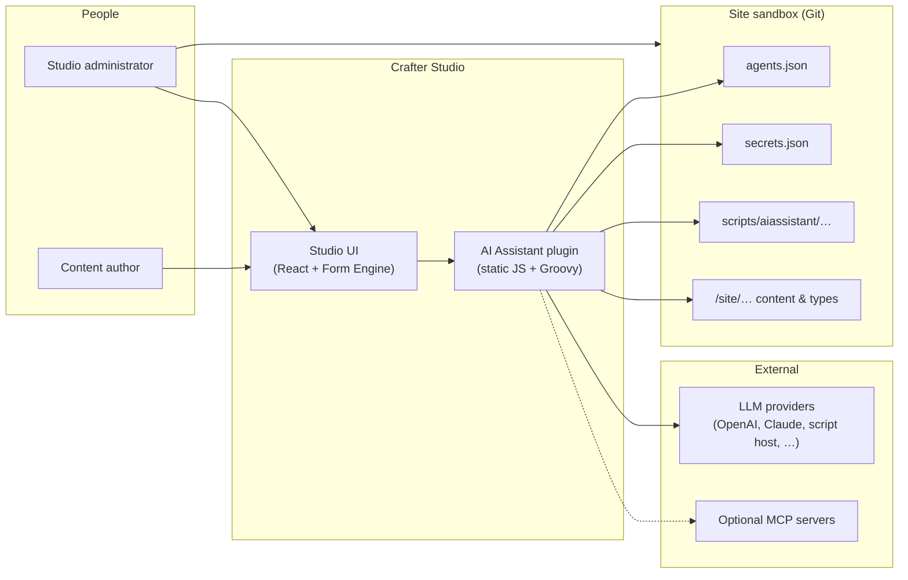

---

## Logical architecture (design)

Layers inside Studio for a single **interactive chat** turn. Autonomous runs reuse the orchestration and tool catalog on a **scheduler** path (see [spec — Autonomous](internals/spec.md#autonomous-assistants-widget-tools-panel)).

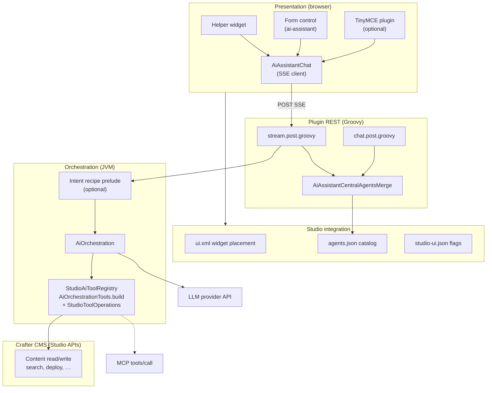

---

## Configuration model (design)

Site-scoped configuration the plugin reads at runtime. **Project Tools → AI Assistant** edits most JSON under `config/studio/`.

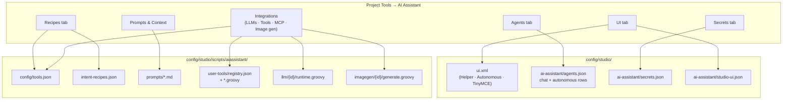

| Artifact | Purpose |
|----------|---------|
| **`agents.json`** | Chat agents (`mode: chat`) and autonomous agents (`mode: autonomous`); **`agentId`**, **`llm`**, models, tools policy, prompts |
| **`secrets.json`** | Site credential slots (`${env:…}`, `${enc:…}`); resolve at runtime only stored rows — **`${secret:…}`** in MCP/agents; **`serpapi_api_key`** for **SerpApiWebSearch** |
| **`ui.xml`** | Registers **Helper**, optional **AutonomousAssistants**, **TinyMCE** external plugin URL |
| **`studio-ui.json`** | Toolbar/sidebar visibility, XB image scope, bulk form-control helpers |
| **`tools.json`** | Built-in tool allow/deny, **`builtInToolSettings`** (e.g. **SerpApiWebSearch** defaults), MCP **`mcpEnabled`** + **`mcpServers`**, intent recipe routing flags |
| **`intent-recipes.json`** | Pre-tools workflow recipes (phases, **`toolsLoopForceTool`**, **`{{studio.today-7D}}`** hints; site override of plugin defaults) |
| **Site scripts** | User tools, script LLMs, image generators, prompt markdown overrides |

---

## Administrator setup workflow

Recommended order for a new site (matches [configuration guide §1–§7](using-and-extending/configuration-guide.md#cg-basic)).

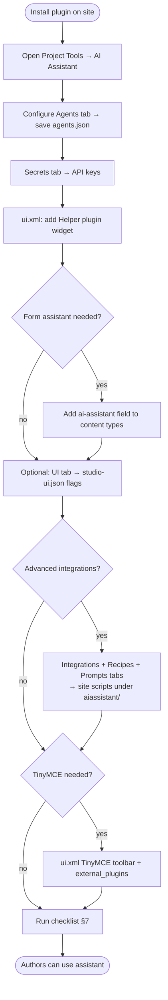

---

## Project Tools configuration map

How admin UI tabs map to repository paths (for troubleshooting “I saved but Studio still …”).

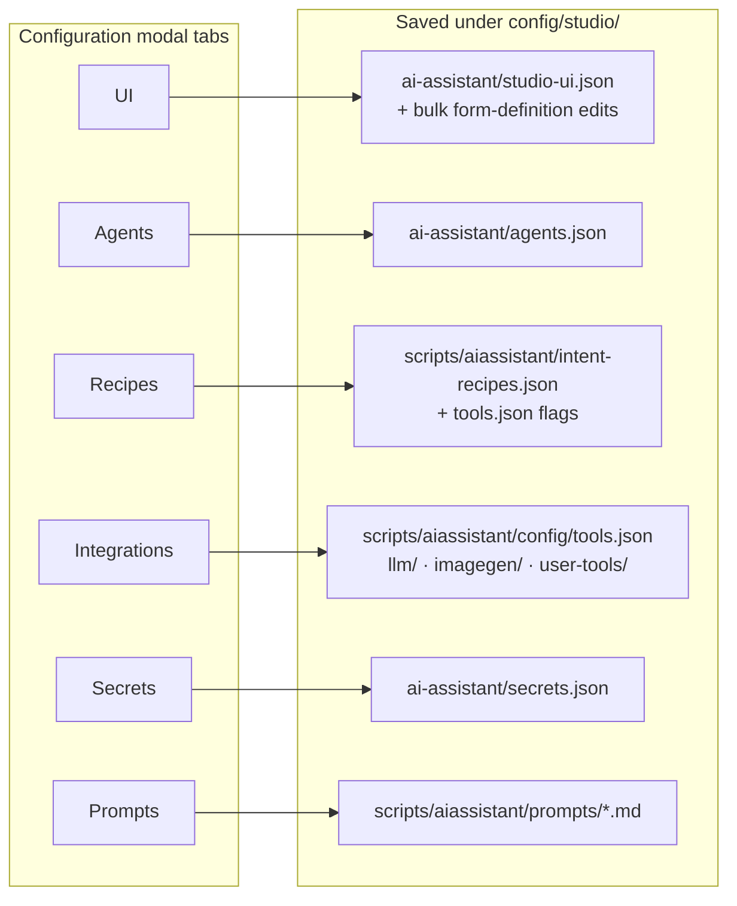

---

## Author experience (user)

Where authors open the assistant (admin enables each surface in **`ui.xml`** / form definitions).

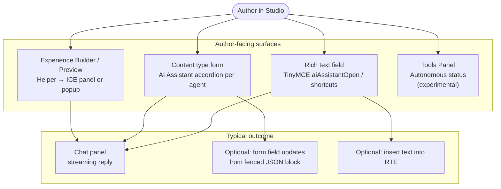

---

## Interactive chat journey (user)

What authors perceive on one message (tools may run server-side without exposing tool JSON in the UI).

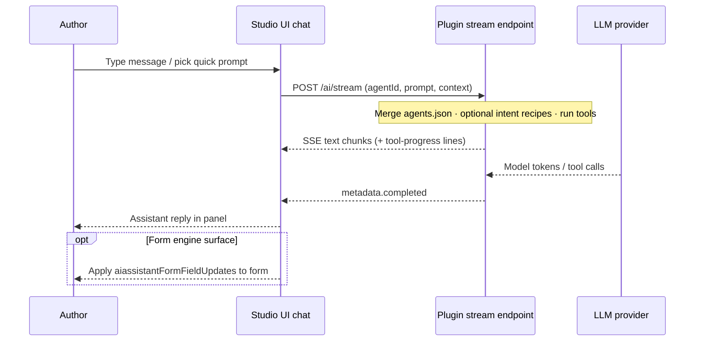

---

## Interactive chat request path (developer)

Server path from REST script through orchestration (simplified; see [intent-recipe-routing.md](internals/intent-recipe-routing.md) for prelude branches).

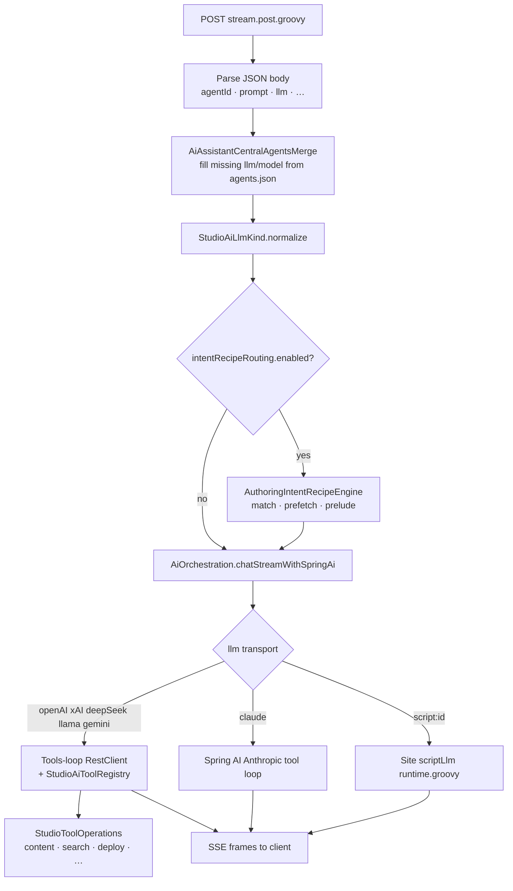

---

## Build and deploy pipeline (developer)

Canonical sources vs generated assets (required invariant from [studio-plugins-guide](using-and-extending/studio-plugins-guide.md)).

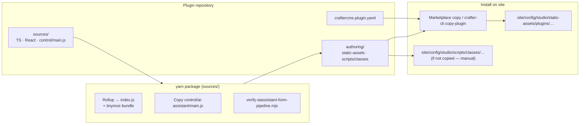

| Edit here | Do not hand-edit |
|-----------|------------------|
| `sources/src/**`, `sources/index.tsx` | `authoring/.../components/index.js` (generated) |
| `sources/control/ai-assistant/main.js` | `authoring/.../control/ai-assistant/main.js` (copied on package) |
| `authoring/scripts/classes/**` | — (ship with plugin; may need manual copy to site) |

---

## Studio UI component registration (developer)

How widgets and the form control reach Studio.

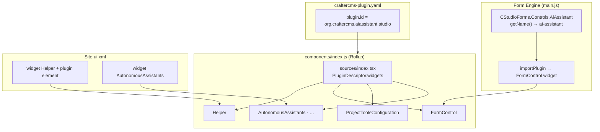

---

## Site extension layout (developer)

Optional site-authored extensions under `config/studio/scripts/aiassistant/`.

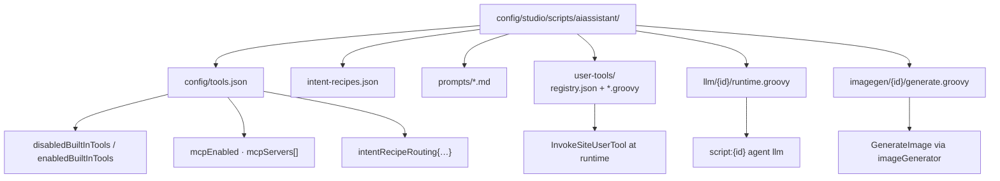

---

## Autonomous scheduler (architecture)

Experimental path: same tool catalog as chat, different trigger and persistence.

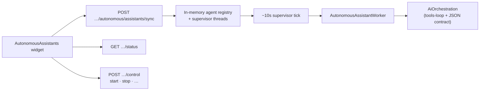

Details: [autonomous-assistants-widget.md](using-and-extending/autonomous-assistants-widget.md) · [spec — Autonomous](internals/spec.md#autonomous-assistants-widget-tools-panel).

---

## LLM transport selection (design)

How **`llm`** on an agent row selects server code paths (see [llm-configuration.md](using-and-extending/llm-configuration.md)).

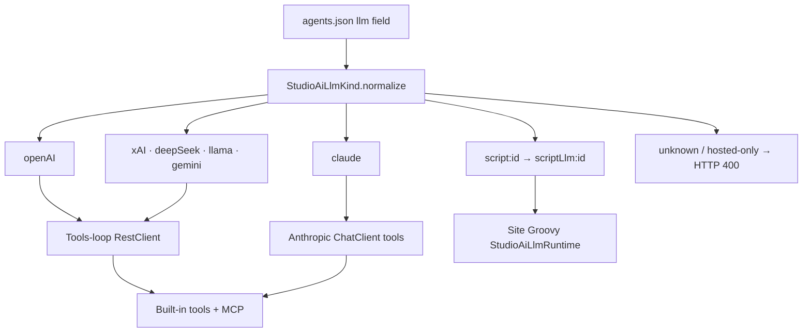

---

## See also

| Topic | Document |
|-------|----------|
| Intent recipe prelude (detailed flowchart) | [intent-recipe-routing.md](internals/intent-recipe-routing.md) |
| SSE contract & stream URL | [stream-endpoint-design.md](internals/stream-endpoint-design.md) |
| REST body fields, MCP, tools | [chat-and-tools-runtime.md](internals/chat-and-tools-runtime.md) |
| Product surfaces & contracts | [spec.md](internals/spec.md) |
| Admin procedures & screenshots | [configuration-guide.md](using-and-extending/configuration-guide.md) |
| Rollup, paths, plugin id | [studio-plugins-guide.md](using-and-extending/studio-plugins-guide.md) |
