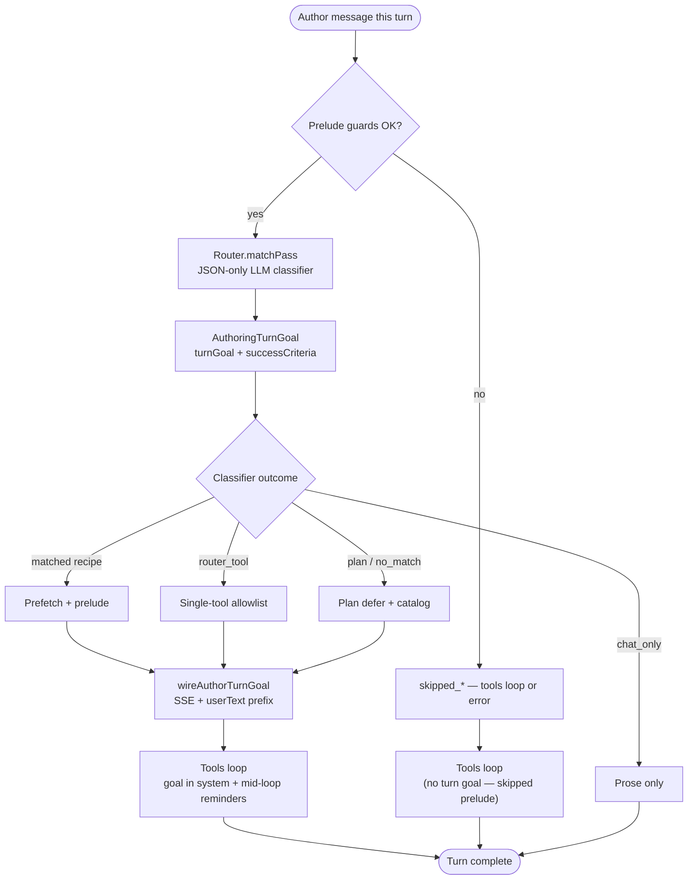
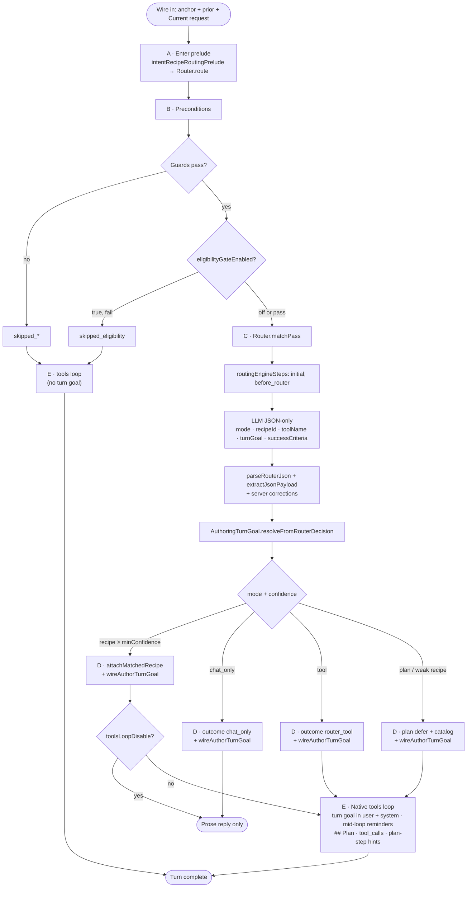
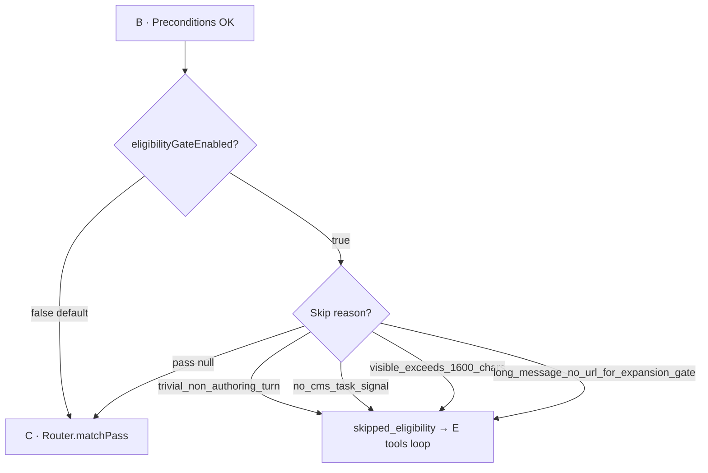
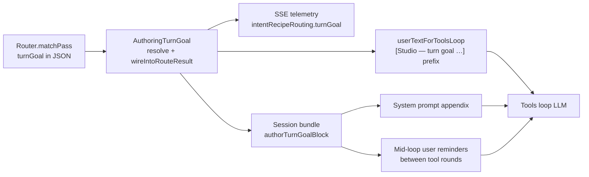

# Intent Recipe Routing (Pre-Tools) and Tools Loop

Companion to **[`chat-and-tools-runtime.md`](chat-and-tools-runtime.md)** and **[`spec.md`](spec.md)** (§ [Intent recipe routing & turn goal](spec.md#intent-recipe-routing-turn-goal) — wire/SSE contract summary). Describes how preview chat classifies an author turn **before** the native tools loop runs, and how that classification affects tool availability, prefetch, and prompts.

**Audience:** Maintainers debugging `intent-recipe-routing` SSE telemetry, `skipped_eligibility`, wrong recipe matches, or tools firing on chat-only turns.

**Configuration:** Project Tools → AI Assistant → **Recipes** tab (`config/studio/scripts/aiassistant/config/tools.json` → `intentRecipeRouting` flags + site recipe catalog). Bundled defaults ship in the plugin JAR: `authoring/scripts/classes/plugins/org/craftercms/aiassistant/studio/engine/routing/authoring-intent-recipes-default.json`. Site overrides: default **`config/studio/scripts/aiassistant/config/intent-recipes.json`** (Project Tools sets **`customRecipesPath`** in `tools.json` on save; routing reads that path only when configured). Admin overview: **[configuration-guide.md §9.0](../using-and-extending/configuration-guide.md#cg-9-0)**. **Broader architecture:** [Architecture & diagrams](../architecture-diagrams.md#logical-architecture-design) (`Router.route` prelude before the tools loop). **Content field plan (copy updates):** **[content-field-plan.md](content-field-plan.md)**.

**Code entry point:** `plugins.org.craftercms.aiassistant.studio.engine.routing.Router.route(...)` — `AiOrchestration.intentRecipeRoutingPrelude` delegates here only. Classifier, catalog markdown, routing-engine prefetch, turn goal, and recipe attach live under `engine/routing/` and `engine/routing/subrouting/`.

**Not in this prelude:** **Autonomous** scheduled runs (`AutonomousAssistantWorker`) skip intent routing and call `AiOrchestration.llmHeadlessNativeToolsCompletion` directly.

---

## Design principle

- **Repository anchor** (`contentPath`, Request anchor on `/site/.../*.xml`) is **context** — which item is open in Studio.
- **CMS intent** follows the **current author message** (`Current request:` line on the wire), not keywords buried in `[Prior conversation …]`.
- A **repo anchor alone** must not add structural competitors for `modify_page_content` or force tools on creative / chat-only turns.
- **Natural language first** — no phrase-list routing for site-wide concepts (e.g. “homepage”); use recipe **`description`** + optional **JSON router** / **## Plan**, not bare “summarize” + anchor fast paths. See **`.cursor/rules/intent-routing-natural-language.mdc`**.

<a id="cross-site-working-site"></a>

### Cross-site working site

When POST **`siteId`** (working site) differs from the Studio session site, the client does **not** send preview **`contentPath`**. **`open_page_inquiry`** is **deferred** (`matchPass: open_page_no_anchor_defer_plan`) unless servlet bindings include a real **`/site/.../*.xml`** path for that turn. Bundled recipe JSON and empty **`tools.json`** load from the **session** site sandbox first; site **`intent-recipes.json`** tries working site then session. The JSON recipe router user message includes **Studio site context** when cross-site. CMS tools still use POST **`siteId`** via **`resolveEffectiveSiteId`** / **`ensureToolArgsSiteId`**.

---

## Routing at a glance (default)

One **interactive** turn, tools-loop LLM, `intentRecipeRouting.enabled: true`, shipped defaults (`eligibilityGateEnabled: false`). The classifier is **`Router.matchPass`** (LLM JSON), not a deterministic pattern gate.



**Read the diagram left to right, top to bottom.**

| Branch | Meaning |
|--------|---------|
| **Whole-turn recipe** (`mode: recipe`) | Classifier picks one recipe id at or above **`minConfidence`** — server runs recipe prefetch + prelude before (or instead of) tools. |
| **Chat only** (`mode: chat_only`) | Tools loop disabled for the turn (creative / research prose, etc.). Turn goal still resolved and emitted in telemetry. |
| **Single tool** (`mode: tool`) | Tools loop restricted to one wired tool name (`outcome: router_tool`). |
| **Plan defer** (`mode: plan` or recipe below confidence) | **## Plan** hint + optional catalog block; tools loop plans per step (`outcome: plan` or `no_match`). **`turnGoal`** keeps the executor aligned even when no whole-turn recipe matches. |
| **Turn goal** | Classifier outcomes only (`matched`, `chat_only`, `router_tool`, `plan` / `no_match`) — not **`skipped_*`** prelude exits. Required **`turnGoal`** from router JSON (with fallbacks) wired into SSE, **`userTextForToolsLoop`**, session bundle, and tools-loop prompts when the classifier runs. |

Recipe JSON still defines **`deterministicMatch`** rules — used for **plan-step hints** inside the tools loop (`matchRecipesForPlanSteps`), not as the primary whole-turn gate. The phased diagram in **[Default flow](#default-flow-shipped--preview-chat-tools-loop-llms)** matches **`Router.route`**.

---

## Default flow (shipped — preview chat, tools-loop LLMs)

This is what runs **out of the box** when intent recipe routing is on and the agent uses a **tools-loop** LLM (`openAI`, `xAI`, `deepSeek`, `llama`, `gemini` / `genesis`, or `script:{id}` with tools-loop wire). Optional branches are in **[Optional paths](#optional-paths-not-default)** below.

### Shipped defaults (`tools.json` → `intentRecipeRouting`)

| Setting | Default when omitted | Effect |
|---------|----------------------|--------|
| `enabled` | `true` | Prelude runs (`Router.route`) |
| `eligibilityGateEnabled` | **`false`** | **No** early message filter — every non-empty turn reaches the LLM classifier |
| `engineEnabled` | `true` | Catalog **`routingEngineSteps`** run (`initial`, `before_router`) and prepend markdown to the router prompt |
| `minConfidence` | `0.55` | `mode: recipe` binds only when classifier confidence ≥ this |
| `customRecipesPath` | *(empty)* | Site recipe JSON is read only when set (Project Tools default: `/scripts/aiassistant/config/intent-recipes.json`) |

**Legacy keys** (`wholeTurnJsonRouterEnabled`, `llmRouterWhenPriorConversation`, `requestClarificationOnUnmatched`) remain in `tools.json` schema for older sites but are **not read** by `Router.route` after the LLM-first refactor — do not document them as active branches.

**Wire in:** `Repository path` / Request anchor + optional `[Prior conversation …]` + **`Current request:`** (current-turn text for routing).

**Does not enter this prelude:** `claude` (Anthropic stack), `omitTools: true` on POST, or `intentRecipeRouting.enabled: false`.

<a id="default-flow-phases"></a>

### Prelude phases A–E (`Router.route`)



### Default path — example turns (anchored page open)

| Current request | Typical default path |
|-----------------|------------------------|
| What is this page about? | B → C1 `mode: recipe` **`open_page_inquiry`** (or server correction) → D prefetch → **no E** when `toolsLoopDisable` |
| Write a short story about … | B → C1 `mode: chat_only` or recipe `llm_research` with tools off → **no E** |
| Update the hero text to … | B → C1 `mode: recipe` **`modify_page_content`** → D prefetch → **E** WriteContent |
| Look up … on the web (single goal) | B → C1 `mode: tool` **`SerpApiWebSearch`** / **`WebSearch`** or recipe `web_research` → **E** |
| Multi-intent / ambiguous wording | B → C1 `mode: plan` → D plan defer catalog → **E** (## Plan + tools per step; **`turnGoal`** guides tool choice) |
| Anchored: “create an image for this page” | B → C1 `mode: plan` → D plan defer → **E** GetContent → GenerateImage (**`turnGoal`** names page-context image) |
| Prior turn: draft prose; current: “save this” / “make it a post” | B → C1 `mode: recipe` **`new_content_item`** → D **`createFromChatDraft`** prefetch → **E** WriteContent (model supplies field ids from form def) |

### Telemetry outcomes (default prelude)

| `outcome` | Meaning |
|-----------|---------|
| `matched` | Whole-turn recipe bound; prefetch + prelude applied (`matchPass: router`) |
| `chat_only` | Classifier chose chat-only; tools loop disabled (`matchPass: router_chat_only`) |
| `router_tool` | Single-tool allowlist on telemetry |
| `plan` | Plan defer hint + catalog; tools loop runs with **## Plan** |
| `no_match` | Generic judgement hint (non-plan branch) |
| `skipped_empty_prompt` / `skipped_no_api_key` / `skipped_no_model` / `skipped_no_recipes` | Preconditions failed |
| `skipped_disabled` | `intentRecipeRouting.enabled: false` |
| `skipped_eligibility` | Eligibility gate only (`eligibilityGateEnabled: true`) |

Entry: `AiOrchestration.intentRecipeRoutingPrelude` → **`Router.route`** when `StudioAiLlmKind.useToolsLoopChatRestClient` is true. `AiOrchestration.applyIntentRecipeRouteEffects` sets `springAi.useTools = false` when telemetry has `toolsLoopDisable` (matched recipe or `chat_only`).

---

## Optional paths (not default)

### Optional: eligibility gate (`eligibilityGateEnabled: true`)

**Off by default.** When **on**, `Router.route` runs `AuthoringPreviewContext.intentRecipeRouterEligibilitySkipReason` after preconditions. Failures return `skipped_eligibility` and skip the classifier (tools loop still runs).



See **[Phase 2 — Eligibility gate](#phase-2--eligibility-gate-optional-off-by-default)** for skip reasons and examples.

### Optional: disable routing entirely

`intentRecipeRouting.enabled: false` → prelude skipped; chat goes straight to **E** with no recipe/prefetch.

### Legacy `tools.json` keys (ignored by `Router.route`)

`wholeTurnJsonRouterEnabled`, `llmRouterWhenPriorConversation`, and `requestClarificationOnUnmatched` are **not** consulted by the current classifier pipeline. Remove them from new site configs; keep only if you need the keys present for diff/merge with older docs.

---

## Phase 1 — Prelude preconditions (runs first in code)

**Class:** `Router.route` (via `AiOrchestration.intentRecipeRoutingPrelude`) — guards run before `Router.matchPass`; optional eligibility gate may follow catalog load.

| Check | Outcome if fail |
|-------|-----------------|
| `ops` non-null | `skipped_ops_null` |
| `intentRecipeRouting.enabled` | `skipped_disabled` |
| Non-empty `bodyPrompt` | `skipped_empty_prompt` |
| Tools-loop API key | `skipped_no_api_key` |
| Not cancelled | `skipped_cancelled` |
| Resolved chat model | `skipped_no_model` |
| Recipe catalog non-empty | `skipped_no_recipes` (+ hint, tools loop) |

Fails here mean routing never called the router LLM and never ran prefetch — regardless of author message content.

---

## Phase 2 — Eligibility gate (optional; **off by default**)

**Configuration:** `intentRecipeRouting.eligibilityGateEnabled` in site `tools.json`. **Default when omitted: `false`** — the gate does not run; every non-empty turn proceeds to **`Router.matchPass`**. Set **`true`** only if you want the short-message / `no_cms_task_signal` / long-paste filters.

**Eligible for what?** When the gate is **enabled**, a turn is **eligible** when `intentRecipeRouterEligibilitySkipReason` returns **null** — meaning the server may run **pre-tools intent recipe routing** on that turn:

- Run **`Router.matchPass`** (LLM classifier)
- On **`mode: recipe`**, run recipe prefetch (e.g. `GetContent` for the anchored path)

It is **not** “eligible to chat” (chat always proceeds) and **not** “eligible for tools” (the **tools loop** often still runs after a skip — see optional diagram: `skipped_eligibility` → **E**).

**Class:** `AuthoringPreviewContext`  
**Method:** `intentRecipeRouterEligibilitySkipReason(fullPrompt)`  
**Alias:** `isAuthoringIntentExpansionCandidate` — same gate; legacy name from pre-`Router` expansion rematch; controls whether **pre-tools routing** runs, not whether the author gets a reply.

When skip reason is **non-null**, prelude returns `outcome: skipped_eligibility` with `eligibilitySkipReason` in telemetry. **No** recipe match, **no** prefetch — the turn skips **C–D** and usually continues to the **tools loop** (**E**). Runs **after** prelude preconditions (catalog and API key already verified). **Not used** when `eligibilityGateEnabled` is false (default).

### Runs routing (eligible) — typical cases

| Signal | Role |
|--------|------|
| `authorCurrentRequestSuggestsCmsTooling` | CMS verbs / field / repo language on **`Current request:`** only |
| `anchoredSiteXmlFieldPlacementIntentForAuthorText` | e.g. “put X in hero text” on anchored item |
| `AuthoringIntentRecipeCatalog.authorVisibleSuggestsConfiguredResearch` | Uses catalog **`routingRecipeFamilies`** + recipe **`matchHints`** / **`deterministicMatch`** (not hardcoded regex) |
| `AuthoringIntentRecipeCatalog.authorSuggestsMultiGoalDefer` | Catalog **`multiGoalDefer.groups`**: ≥2 groups signal → **Complex** plan defer (suppresses a lone deterministic recipe) |
| `authorCurrentRequestLooksLikeCreativeLlmOnly` | generate/write story, etc. |
| `authorCurrentRequestEditsPriorChatArtifact` | “this story”, “two paragraphs”, revise prior assistant reply |
| `authorConversationPivotedToChatOnlyArtifact` | prior turn was creative; current turn edits chat artifact |
| `authorCurrentRequestLooksLikePriorTurnFollowUp` | short follow-ups (“make it shorter”) with guards |
| `priorConversationContainsActionableContent` / `priorConversationContainsDraftBody` | prior block has extractable prose (site markers, substantial `##`, or long assistant reply) |
| `createFromPriorDraftFollowup` | deictic + CMS persist intent (“save **this**”, “make **it** into …”) with actionable prior chat — not blog/post-specific |
| Anchor **or** prior conversation on wire | multi-turn session still runs router even without CMS keywords on this line |
| Short visible text | ≤ ~320 chars on expansion slice (`AUTHORING_INTENT_EXPANSION_SHORT_VISIBLE_MAX_CHARS`) |
| Long + URL + visual/reference language | expansion gate for URL-heavy asks |

### Skips routing — typical cases

| `eligibilitySkipReason` | Meaning |
|-------------------------|---------|
| `trivial_non_authoring_turn` | Greeting / chit-chat (unless short affirmation continuing CMS work) |
| `no_cms_task_signal` | No CMS/research/creative signal **and** no anchor/prior conversation |
| `visible_exceeds_1600_chars` | Long paste without qualifying current-line exception |
| `long_message_no_url_for_expansion_gate` | Long message without URL/visual gate (uses current-line slice when prior conversation present) |
| `empty_visible_after_strip` | Nothing left after stripping Studio blocks |

**Length gates:** When `[Prior conversation …]` is present, expansion length checks use `intentExpansionVisibleSlice` (**current request**), not the full wire.

---

## Phase 3 — Classifier pass and outcomes (inside prelude)

See **[Routing at a glance](#routing-at-a-glance-default)** for the simplified decision flow.

**Class:** `Router`  
**Method:** `matchPass` (called from `Router.route` after Phase 1 and optional Phase 2 eligibility gate)

### Inputs

- **`bodyPrompt` / `cand`:** Full wire (anchor, prior turns, `Current request:`).
- **`routerVisible`:** `AuthoringPreviewContext.extractAuthorCurrentRequestVisible(cand)` — primary text sent to the classifier.
- **`detCtx`:** `cand`, `routerVisible`, `ops`, and predicates used by catalog helpers and server-side routing corrections.

### `Router.matchPass` (LLM classifier)

1. **Routing-engine prefetch** — When `intentRecipeRouting.engineEnabled` is true, `AuthoringIntentRoutingEngine` runs catalog **`routingEngineSteps`** for passes **`initial`** and **`before_router`**, prepending markdown to the router user message.

2. **LLM classifier** — `llmCompleter` calls the router system prompt (`ToolPrompts.getLlm_AUTHORING_INTENT_RECIPE_ROUTER_SYSTEM`) with:
   - Recipe catalog markdown (`AuthoringIntentRecipeCatalog.toRouterCatalogMarkdown`)
   - Wired tools catalog (`toRouterToolsCatalogMarkdown`)
   - Current-turn visible text + optional prior conversation block

   **`AuthoringIntentRecipeRouter.parseRouterJson`** returns **`mode`**: `chat_only` | `recipe` | `tool` | `plan`, plus `recipeId`, `toolName`, `confidence`, `reason`, required **`turnGoal`**, and optional **`successCriteria`**. The router completion uses **JSON-only** simple completion (no refine tools) so prose from prior turns does not break parsing; **`extractJsonPayload`** strips leading markdown when a `{…}` object is present.

3. **Turn goal resolution** — **`AuthoringTurnGoal.resolveFromRouterDecision`** fills missing `turnGoal` / `successCriteria` from router `reason`, author visible text, recipe id, and routing mode. **`Router.wireAuthorTurnGoal`** on **classifier outcomes** (`matched`, `chat_only`, `router_tool`, `plan` / `no_match`) calls **`AuthoringTurnGoal.wireIntoRouteResult`**, which:
   - Sets **`intentRecipeRoutingTelemetry.turnGoal`** and **`successCriteria`** (SSE / debug log)
   - Prepends **`[Studio — turn goal …]`** to **`userTextForToolsLoop`**
   - Stores **`authorTurnGoal`**, **`authorTurnSuccessCriteria`**, **`authorTurnGoalBlock`** on the session bundle

4. **Server corrections** — Examples: force **`open_page_inquiry`** for read-only page summary asks; image-generation routing adjustment (`applyAuthorGeneratedImageRoutingCorrection`).

5. **Wire outcome** — `Router.route` branches:
   - **`recipe`** + confidence ≥ **`minConfidence`** → `attachMatchedRecipe` (`matchPass: router`, `outcome: matched`)
   - **`chat_only`** → tools off (`matchPass: router_chat_only`, `outcome: chat_only`)
   - **`tool`** → `toolsLoopAllowlist` (`matchPass: router_tool`, `outcome: router_tool`)
   - **`plan`** or recipe below confidence → plan defer hint + catalog (`matchPass: router_plan`, `outcome: plan` or `no_match`)

### Turn goal through the tools loop

<a id="turn-goal-through-the-tools-loop"></a>

After routing, the executor (tools-loop LLM) receives the turn goal at three reinforcement points:



| Stage | Mechanism |
|-------|-----------|
| User message | **`[Studio — turn goal …]`** block prepended to **`userTextForToolsLoop`** |
| System message | **`AuthoringTurnGoal.appendToSystemWireMessage`** appends goal + execution policy |
| Mid-loop | **`AuthoringTurnGoal.formatMidLoopReminder`** injected as a user message between tool rounds |

**Class:** `AuthoringTurnGoal` (`engine/routing/subrouting/AuthoringTurnGoal.groovy`). The goal **mutates every author message** — each turn gets a fresh router classification and goal; prior turns are context only.

**Offline tests:** `scripts/test/functional/router-json-offline.mjs` (JSON extract/parse); scenario `expect.turnGoalPresent` / `turnGoalContains` via `lib/sse-telemetry.mjs`.

### Plan-step deterministic hints (inside tools loop, not prelude)

After the model emits **## Plan**, `AiOrchestration` may call **`AuthoringIntentRecipeCatalog.matchRecipesForPlanSteps`**, which evaluates recipe **`deterministicMatch`** rules per step. Telemetry: **`planStepRecipeMatches`**; wire prefix **`[Studio — plan-step recipe hints]`** once per turn.

**`deterministicMatch` schema** (site `intent-recipes.json` overrides):

| Field | Role |
|-------|------|
| `priority` / `routerReason` | Telemetry / plan-step hints. |
| `authorFromMatchHints` | Treat recipe `matchHints` as `authorContainsAny`. |
| `respectDontMatchHints` | Drop match if author text hits `dontMatchHints`. |
| `requiresAnchoredSiteXml` / `requiresNoAnchoredSiteXml` | Anchor on `/site/.../*.xml`. |
| `when` | Leaf id or nested `{ allOf, anyOf, not }` via `AuthoringIntentRecipeWhen`. |

**Catalog routing config:** `routingRecipeFamilies`, `multiGoalDefer` — used by catalog helpers and eligibility; not a separate whole-turn deterministic gate in `Router.route`.

### Prelude outcomes

| `outcome` | Behavior |
|-----------|----------|
| `matched` | `Router.attachMatchedRecipe`: recipe prefetch (`AuthoringIntentRecipeEngine.runPrefetchBlock`), prelude on `userTextForToolsLoop`; telemetry includes `recipeId`, `prefetchSteps`, `toolsLoopDisable`, `toolsLoopAllowlist`, `toolsLoopForceTool` |
| `chat_only` | Tools loop disabled for the turn |
| `router_tool` | Single-tool allowlist on telemetry |
| `plan` | Plan defer hint + recipe/tool catalog; tools loop runs |
| `no_match` | Generic judgement hint when not deferring to plan |
| `skipped_disabled` | Routing off in `tools.json` |
| `skipped_eligibility` | Eligibility gate only (`eligibilityGateEnabled: true`) |
| `skipped_*` | Empty prompt, no API key, cancelled, empty catalog, etc. |

### Matched recipe prelude text

**Method:** `AuthoringIntentRecipeCatalog.formatMatchedRecipePrelude` — prepended to `userTextForToolsLoop` on **`matched`**.

- **Execution plan (model-authored ## Plan):** `AuthoringIntentRecipePlanCompiler` compiles phases into a JSON plan block: **action** hints → **`llm`** steps (the model mirrors them in **## Plan** + **`CRAFTERRQ_ORCH`**); **confirmation** `engineSteps` → **`serverExecute`** tool steps Studio runs on the JVM **after** Action-phase chat work (not in prefetch).
- **Phases:** `phases.context`, `phases.action`, `phases.confirmation` (author-facing bullets) plus optional **`matchedUserPrelude`**.
- **Prefetch vs confirmation engine:** `collectPrefetchEngineSteps` runs at turn start (context + action read-only tools only); `collectConfirmationEngineSteps` runs when the tools loop ends with a final assistant message (no further **`tool_calls`**). When Confirmation is hint-only (string list), `inferConfirmationEngineStepsFromHints` adds JVM steps for wires named in hints that opt into `recipeEngineConfirmationStep()` and appear on the recipe allowlist. Before each confirmation step runs, `StudioAiToolRegistry.mergeRecipeConfirmationArgs` passes Action-phase assistant prose to the tool’s `applyRecipeConfirmationArgDefaults` (per-tool; default no-op).
- **Clock templates:** `StudioRecipeClockTemplates` expands `{{studio.today}}`, `{{studio.today-7D}}`, `{{studio.now}}`, `{{studio.now-2H}}`, etc. (server time zone; offsets subtract; units `D`/`W`/`M` on dates, `H`/`D`/`W`/`M` on `now`) before binding refs.
- **Binding templates:** `AuthoringIntentRecipeBindings.expandHintTemplates` expands `{{initial.*}}` / `{{current.*}}` from prefetch artifacts.
- **Web research:** when phases imply web research and **`toolsLoopForceTool`** is set (e.g. **`SerpApiWebSearch`**), the prelude adds round-0 search requirements and **`FetchHttpUrl`** caps from the recipe row.

Admin examples: **[configuration-guide.md §9.0](../using-and-extending/configuration-guide.md#cg-9-0)**.

### Matched recipe effects on tools

**Method:** `applyIntentRecipeRouteEffects`

- **`toolsLoopDisable: true`** (e.g. `llm_research`, read-only `open_page_inquiry` with successful prefetch): `springAi.useTools = false` — **no** native tools loop; model answers from prefetch + prelude only.
- **`toolsLoopAllowlist`**: filter registered tools to named set.
- **`toolsLoopForceTool`**: round 0 `tool_choice` forced to that function (e.g. **`SerpApiWebSearch`**, **`GetContent`** for inquiry prefetch).

Bundled chat-only recipes (`llm_research` with `creative_llm_only` / `chat_artifact_followup` deterministic entries) set `toolsLoopDisable: true` in `authoring-intent-recipes-default.json`.

### Confirmation phase (post-action JVM steps)

After Action-phase chat work (model **## Plan**, **`CRAFTERRQ_ORCH`**, and wired **`tool_calls`** such as **`SerpApiWebSearch`** / **`FetchHttpUrl`**), Studio may run **`phases.confirmation`** tools on the JVM — **not** via LLM **`tool_calls`**.

| Mechanism | When it runs |
|-----------|----------------|
| **`collectConfirmationEngineSteps`** | Reads explicit **`engineSteps`** under **`phases.confirmation`**: **`tool`** rows (JVM tools) and optional **`llmRefine`** rows (server-side markdown refine before outbound tools). |
| **`inferConfirmationEngineStepsFromHints`** | When Confirmation is hint-only (string list), infers steps for allowlisted wires named in hints that implement **`recipeEngineConfirmationStep()`** (today: **`SlackPostMessage`**). |
| **`maybeExecuteMatchedRecipeConfirmationSteps`** | Tools loop hook in **`AiOrchestration`**: runs once per turn when the model finishes without further **`tool_calls`** and **`confirmationServerStepsPending`** is true (**`outcome`** **`matched`**). **`FetchHttpUrl`** caps apply only during tool rounds, not to skipping confirmation at turn end. |

**LLM refine (`llmRefine`):** When an **`engineSteps`** row includes **`llmRefine`** (profile id is telemetry only), **`AuthoringIntentRecipeLlmRefiner`** runs a bounded non-streaming completion before outbound tools:

| `outputFormat` | Behavior |
|----------------|----------|
| **`json`** (recommended for multi-post Slack) | Model returns one JSON object with string values for each key in **`outputKeys`**. Result is stored as **`payload`** and exposed for bindings (`$name.key` when the step has **`as`**). Optional **`passthroughFromSource`** (`{ "draft": ["Draft body", "Pitch draft"] }`) copies a `##` section from the assistant turn **without** an LLM rewrite (keys in this map are **excluded** from the main JSON completion). If no section matches, optional **`passthroughFallbackHints`** + **`passthroughFallbackMaxOutTokens`** run a dedicated single-key completion (e.g. full **draft** on its own Slack post). |
| **`markdown`** (default) | Rewrites assistant prose (optional **`markdownSection`** for one `##` block via **`RecipeMarkdownSections`**). |

Site recipes supply rules via **`userPreamble`**, **`hints`**, and optional **`systemPrompt`**. Disable globally with **`intentRecipeRouting.confirmationLlmRefineEnabled: false`** in **`tools.json`**.

**Arg resolution:** Confirmation tool **`args`** support **`$stepN.field`**, **`$bindingName.field`** (from a prior step’s **`as`**), and studio **`$initial.*` / `$current.*`**. Each outbound tool step should set explicit **`text`** (or **`message`**) — e.g. **`"text": "$slackOutbound.root"`** after a JSON refine step with **`"as": "slackOutbound"`**.

**Arg merge:** **`StudioAiToolRegistry.mergeRecipeConfirmationArgs`** may apply tool-specific formatting (e.g. Slack mrkdwn) when **`text`** is already set; it does **not** scrape assistant markdown for post bodies.

**Example — explicit confirmation step (site `intent-recipes.json`):**

```json
"phases": {
  "confirmation": {
    "hints": [
      "Post a concise summary to Slack for review (Studio runs SlackPostMessage after chat work)."
    ],
    "engineSteps": [
      {
        "llmRefine": "editorialPitch",
        "hints": ["Optional per-site coach hints appended to the refine user message."]
      },
      { "tool": "SlackPostMessage", "args": {} }
    ]
  }
}
```

Set **`builtInToolSettings.SlackPostMessage.defaultChannel`** in **`tools.json`** (or pass **`channel`** in **`args`**). The bot must be invited to private channels; channel names (`random`, `#random`) are resolved to **`C…`** ids via **`conversations.list`**.

**Slack body formatting:** Set **`text`** on each **`SlackPostMessage`** step (usually from **`$refineBinding.key`**). **`SlackPostMessageTool`** applies generic mrkdwn conversion via **`SlackConfirmationPostFormatter`**. Use **`args.threadTs`** with **`$slackRoot.ts`** (or **`$stepN.ts`**) from an earlier post step’s **`as`**.

**Example — threaded Slack (JSON refine + five posts):**

```json
"engineSteps": [
  {
    "llmRefine": "slackOutbound",
    "as": "slackOutbound",
    "outputFormat": "json",
    "outputKeys": ["root", "craftercmsAlignment", "draft", "pitch", "sources"],
    "passthroughFromSource": { "draft": ["Draft body", "Pitch draft"] },
    "passthroughFallbackHints": { "draft": ["… full draft when ## section missing …"] },
    "hints": ["… root / alignment / pitch / sources in main JSON …"]
  },
  { "tool": "SlackPostMessage", "as": "slackRoot", "args": { "text": "$slackOutbound.root" } },
  { "tool": "SlackPostMessage", "args": { "threadTs": "$slackRoot.ts", "text": "$slackOutbound.draft" } },
  { "tool": "SlackPostMessage", "args": { "threadTs": "$slackRoot.ts", "text": "$slackOutbound.sources" } }
]
```

**Wire message after confirmation:** Studio appends a **`role: user`** block with confirmation results; the model must record outcomes in **## Plan Execution** and must **not** call confirmation tools again via **`tool_calls`**.

---

## Phase 4 — Native tools loop

Runs when `springAi.useTools` remains true after prelude.

When a matched recipe has Confirmation **`engineSteps`**, the loop runs **`maybeExecuteMatchedRecipeConfirmationSteps`** once when the model finishes without further **`tool_calls`**; see **[Confirmation phase](#confirmation-phase-post-action-jvm-steps)**.

**Method:** `executeNativeToolsViaRestClientReturnText` (multi-round).

- Builds wire: system + user (`userTextForToolsLoop` includes recipe prelude, expansion prefix, no-match hints).
- **Round 0 `tool_choice` biases:** recipe `toolsLoopForceTool` when set (e.g. `SerpApiWebSearch` on site recipes); else web research → `WebSearch`; revert → `revert_change`; image-only → `GenerateImage`; bundled `web_research` still defaults to `WebSearch` unless the site overrides the recipe.
- **Loop:** completion with `tools[]` → execute tool calls → append `role:tool` results → repeat until text-only finish or max rounds.
- **Tier selection:** when the client sends **`Current request:`**, trivial-turn detection and model policy treat **only** that section as the author’s words this turn (`AuthoringPreviewContext.isTrivialNonAuthoringTurn`, `ToolPrompts` plan tiers) — not prior chat or Studio metadata alone.
- **Truncation:** large tool JSON capped on wire; `GetContent` keeps path/metadata; `GenerateImage` uses inline ref pattern.

**Prose-declared tools:** When the model omits API `tool_calls` but prints fenced JSON (e.g. `{"toolId":"…"}`) or names a wired tool in the block, `ProseDeclaredToolCalls` synthesizes invocations from the session `byName` catalog (built-in, `InvokeSiteUserTool`, `mcp_*` — same execution path).

**Not** part of intent routing: model choosing wrong tools after `no_match`, malformed `WriteContent` XML, or optional `ResearchSiteContent` when tools are unrestricted — those are loop execution issues.

---

## Key classes and files

| Area | Location |
|------|----------|
| **Routing entry point** | `engine/routing/Router.groovy` (`route`, `matchPass`, `attachMatchedRecipe`) |
| Classifier JSON parse | `engine/routing/subrouting/AuthoringIntentRecipeRouter.groovy` |
| Turn goal resolve + wire | `engine/routing/subrouting/AuthoringTurnGoal.groovy` |
| Routing-engine prefetch passes | `engine/routing/subrouting/AuthoringIntentRoutingEngine.groovy` |
| Eligibility + current-turn signals | `engine/context/AuthoringPreviewContext.groovy` |
| Recipe catalog, plan-defer context, plan-step deterministic match | `AuthoringIntentRecipeCatalog.groovy`, `AuthoringIntentRecipeWhen.groovy` |
| Plan-defer wired-tools catalog | `AiOrchestrationTools.groovy` (`wireNamesForPlanDeferCatalog` from registered callbacks, `formatPlanDeferToolsCatalogMarkdown`) |
| Bundled recipes + routing config | `engine/routing/authoring-intent-recipes-default.json` (`routingRecipeFamilies`, `multiGoalDefer`) |
| Orchestration delegate + tools loop | `AiOrchestration.groovy` (`intentRecipeRoutingPrelude`, `applyIntentRecipeRouteEffects`, plan-step hints) |
| Tools-loop wire policy (progress, truncation, prose JSON) | `engine/policy/ToolsLoopWirePolicyRegistry.groovy`, `engine/turn/ProseDeclaredToolCalls.groovy` |
| Recipe engineSteps prefetch (matched recipe) | `AuthoringIntentRecipeEngine.groovy` |
| Execution plan compile + confirmation JVM steps | `AuthoringIntentRecipePlanCompiler.groovy`, `AuthoringIntentRecipeEngine.runConfirmationStepsBlock`, `AiOrchestration.maybeExecuteMatchedRecipeConfirmationSteps` |
| Confirmation arg merge + tool dispatch | `StudioAiToolRegistry.mergeRecipeConfirmationArgs`, `StudioAiToolRegistry.executeRecipeConfirmationTool` |
| Recipe-engine tool context (`tools.json` defaults) | `StudioAiToolContext.forRecipeEngine` |
| Slack confirmation post + channel resolve | `SlackPostMessageTool.groovy`, `SlackConfirmationPostFormatter.groovy` |
| Phase prelude + `{{studio.*}}` clock templates | `AuthoringIntentRecipeCatalog.groovy`, `StudioRecipeClockTemplates.groovy`, `AuthoringIntentRecipeBindings.groovy` |
| Site secrets + macro expansion | `StudioAiAssistantSecretsService.groovy`, `StudioAiSecretMacroResolver.groovy` |
| SerpAPI web search wire | `SerpApiWebSearchTool.groovy`, `SerpApiWebSearchProjectSettings.groovy` |
| Router system prompt | `ToolPrompts.groovy` (`getLlm_AUTHORING_INTENT_RECIPE_ROUTER_SYSTEM`) |
| Feature flags | `StudioAiAssistantProjectConfig` (`intentRecipeRoutingEnabled`, `intentRecipeMinConfidence`, …) |

---

## Debug telemetry (SSE / session logs)

`metadata.intentRecipeRouting` / `intentRecipeRoutingTelemetry` commonly includes:

- `outcome` — `matched`, `chat_only`, `router_tool`, `plan`, `no_match`, `skipped_eligibility`, …
- `eligibilitySkipReason` — when skipped at gate
- `recipeId`, `confidence`, `matchPass`, `routingMode` — classifier: `router`, `router_chat_only`, `router_tool`, `router_plan`; legacy deterministic `matchPass` values may appear only in **plan-step** telemetry
- `planStepRecipeMatches` — optional per **## Plan** step hints (`stepId:recipeId`, …) from `matchRecipesForPlanSteps`
- **Plan defer catalog (planner wire)** — when `deferToPlanLoop`: `planDeferCatalogSent` (block with `[Studio — plan defer: recipe + tool catalog]` prepended to `userTextForToolsLoop`), `planDeferCatalogChars`, `planDeferWiredToolCount`, `planDeferWiredToolNames` (may be truncated in telemetry), `planDeferSiteUserToolCount`, `planDeferSiteUserToolIds`, `planDeferInvokeSiteUserToolWired`, `planDeferMcpClientEnabled`. Session debug log **TIMELINE** prints these on the `intent-recipe-routing` SSE row.
- `intentExpansionRematch` — pass 2 ran
- `prefetchSteps`, `prefetchRan`, `toolsLoopDisable`
- `confirmationServerStepsPending` — compiled plan has Confirmation **`engineSteps`** (set on **`matched`**)
- `confirmationServerStepsExecuted`, `confirmationServerStepsOk`, `confirmationServerStepSummaries` — after JVM confirmation runs
- `executionPlanStepCount` — steps in compiled execution plan
- `routerReason`, `recipeFoundInCatalog`
- **`turnGoal`** — plain-language objective for **this turn only** (required from router LLM; fallback when omitted)
- **`successCriteria`** — optional verification phrase (e.g. after WriteContent or GenerateImage)

Use these fields to see whether a turn failed at **preconditions**, **routing (match)**, optional **eligibility gate**, **tools loop execution**, or **confirmation** (pending vs executed vs ok). When debugging wrong tool choice in **plan defer**, confirm **`turnGoal`** reflects the author’s current request (not a prior turn’s plan markdown).

---

## Maintainer checklist (routing regressions)

When chat-only turns hit tools:

1. Confirm **`Current request:`** is present on the wire (client sends abbreviated prior block + current line).
2. Check `eligibilityGateEnabled` in telemetry — if false (default), ignore `skipped_eligibility` unless the site turned the gate on.
3. If gate on: check `eligibilitySkipReason` — was routing skipped before match?
4. If routing ran: `routingMode`, `matchPass`, and `recipeId` — was outcome `plan` vs `matched` vs `router_tool`?
5. Check **`turnGoal`** and **`successCriteria`** in telemetry — does the executor’s objective match the author’s **current** message?
6. Grep competitors: structural `modify_page_content` should require `authorCurrentRequestSuggestsCmsTooling` on the wire.
7. Confirm site deployed classes match repo (Groovy compile errors in preview context break the whole servlet).

**Site-agnostic rule:** Do not hardcode field ids, demo copy, or site paths in eligibility or structural competitors — resolution belongs in tools + form definition + author message (see `.cursor/rules/no-project-specific-content.mdc`).

---

## Related docs

- **[`chat-and-tools-runtime.md`](chat-and-tools-runtime.md)** — tool wiring, SSE, MCP, troubleshooting  
- **[`configuration-guide.md`](../using-and-extending/configuration-guide.md)** — Project Tools UI, `tools.json`  
- **[`maintainer-review-checklist.md`](maintainer-review-checklist.md)** — review anti-patterns
