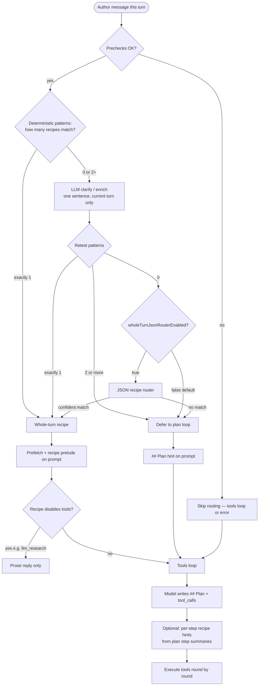

# Intent Recipe Routing (Pre-Tools) and Tools Loop

Companion to **[`chat-and-tools-runtime.md`](chat-and-tools-runtime.md)** and **[`spec.md`](spec.md)**. Describes how preview chat classifies an author turn **before** the native tools loop runs, and how that classification affects tool availability, prefetch, and prompts.

**Audience:** Maintainers debugging `intent-recipe-routing` SSE telemetry, `skipped_eligibility`, wrong recipe matches, or tools firing on chat-only turns.

**Configuration:** Project Tools → AI Assistant → **Recipes** tab (`tools.json` → `intentRecipeRouting` flags + site **`intent-recipes.json`** catalog). Bundled defaults ship in the plugin JAR: `authoring/scripts/classes/plugins/org/craftercms/aiassistant/recipes/authoring-intent-recipes-default.json`. Site overrides: `config/studio/scripts/aiassistant/intent-recipes.json` (path configurable via **custom recipes path**). Admin overview: **[configuration-guide.md §9.0](../using-and-extending/configuration-guide.md#cg-9-0)**. **Broader architecture:** [Architecture & diagrams](../architecture-diagrams.md#logical-architecture-design) (recipe prelude in the orchestration layer).

---

## Design principle

- **Repository anchor** (`contentPath`, Request anchor on `/site/.../*.xml`) is **context** — which item is open in Studio.
- **CMS intent** follows the **current author message** (`Current request:` line on the wire), not keywords buried in `[Prior conversation …]`.
- A **repo anchor alone** must not add structural competitors for `modify_page_content` or force tools on creative / chat-only turns.

---

## Routing at a glance (default)

One turn, tools-loop LLM, `intentRecipeRouting.enabled: true`, shipped defaults (`eligibilityGateEnabled: false`, `wholeTurnJsonRouterEnabled: false`).



**Read the diagram left to right, top to bottom.**

| Branch | Meaning |
|--------|---------|
| **Whole-turn recipe** | One workflow fits the **entire** current message — server runs that recipe’s prefetch and guidance before (or instead of) tools. |
| **Clarify / enrich** | No single pattern yet — small LLM pass restates what the author wants **this turn**; patterns are tried again. |
| **Defer to plan loop** | Still ambiguous or unmatched — **do not** force one recipe for the whole turn; the main tools loop uses **## Plan** (one step per goal). |
| **JSON recipe router** | **Optional** (`wholeTurnJsonRouterEnabled: true`) — legacy whole-turn classifier when zero patterns match after clarify. **Off by default.** |

The box diagram in **[Default flow](#default-flow-shipped--preview-chat-tools-loop-llms)** below adds prelude letters (A–E), expansion rematch, and eligibility-gate hooks for maintainers.

---

## Default flow (shipped — preview chat, tools-loop LLMs)

This is what runs **out of the box** when intent recipe routing is on and the agent uses a **tools-loop** LLM (`openAI`, `xAI`, `deepSeek`, `llama`, `gemini` / `genesis`, or `script:{id}` with tools-loop wire). Optional branches are in **[Optional paths](#optional-paths-not-default)** below.

### Shipped defaults (`tools.json` → `intentRecipeRouting`)

| Setting | Default when omitted | Effect on diagram |
|---------|----------------------|-------------------|
| `enabled` | `true` | Prelude runs |
| `eligibilityGateEnabled` | **`false`** | **No** early message filter — every non-empty turn reaches recipe match |
| `engineEnabled` | `true` | Prefetch engine runs on match |
| `requestClarificationOnUnmatched` | `false` | On `no_match`, tools loop runs (no tools-off clarification turn) |
| `wholeTurnJsonRouterEnabled` | **`false`** | When off, zero/multiple deterministic hits defer to **## Plan** (no JSON router forcing one recipe) |
| `minConfidence` | `0.55` | Whole-turn JSON router must meet this when `wholeTurnJsonRouterEnabled: true` |

**Wire in:** `Repository path` / Request anchor + optional `[Prior conversation …]` + **`Current request:`** (current-turn text for routing).

**Does not enter this prelude:** `claude` (Anthropic stack), `omitTools: true` on POST, or `intentRecipeRouting.enabled: false`.

```
                         Wire in (anchor + prior + Current request:)
                                    │
    ┌───────────────────────────────┴───────────────────────────────┐
    │ A  Enter prelude                                                │
    │    useToolsLoopChatRestClient + intentRecipeRouting.enabled     │
    └───────────────────────────────┬─────────────────────────────────┘
                                    │
    ┌───────────────────────────────┴───────────────────────────────┐
    │ B  Preconditions (fail fast)                                    │
    │    empty prompt · API key · model · recipe catalog loaded       │
    └───────────────────────────────┬─────────────────────────────────┘
                                    │
    ┌───────────────────────────────┴───────────────────────────────┐
    │ C  Recipe match — intentRecipeRoutingMatchPass                 │
    │                                                                 │
    │    C1  deterministicMatch rules → exactly one hit → matched     │
    │                                                                 │
    │    C2  Else clarify/enrich LLM (disambiguate or zero-match)     │
    │         → retest deterministic → one hit → matched              │
    │                                                                 │
    │    C3  Still multiple hits → deferToPlanLoop (no whole-turn     │
    │         recipe); tools loop uses ## Plan per step               │
    │                                                                 │
    │    C4  Still zero hits → deferToPlanLoop (default) OR optional  │
    │         wholeTurnJsonRouterEnabled → JSON router → matched      │
    │                                                                 │
    │    If defer/no_match and CMS bias: expansion rematch → C       │
    └───────────────────────────────┬─────────────────────────────────┘
                                    │
    ┌───────────────────────────────┴───────────────────────────────┐
    │ D  Apply match outcome                                          │
    │                                                                 │
    │    matched → prefetch (GetContent, form def, …) + recipe prelude  │
    │              on userTextForToolsLoop                            │
    │                                                                 │
    │    matched + toolsLoopDisable (e.g. llm_research, read-only     │
    │              open_page_inquiry with prefetch) → prose only      │
    │                                                                 │
    │    no_match → Studio hint on prompt → continue below          │
    └───────────────────────────────┬─────────────────────────────────┘
                                    │
    ┌───────────────────────────────┴───────────────────────────────┐
    │ E  Native tools loop (unless toolsLoopDisable)                │
    │    multi-round tool_calls → assistant text                    │
    └───────────────────────────────────────────────────────────────┘
```

### Default path — example turns (anchored page open)

| Current request | Typical default path |
|-----------------|------------------------|
| What is this page about? | B → C1 `open_page_inquiry` → D prefetch → **no E** (tools off) |
| Write a short story about … | B → C1 `creative_llm_only` / `llm_research` → D tools off → **no E** |
| Research X vs Y and draft a post (prose) | B → **`llm_research` only** (`research` / `versus` match; **`new_content_item` blocked** — “draft a post” here means chat prose, not WriteContent) → D tools off |
| Update the hero text to … | B → C1/C2 `modify_page_content` → D prefetch → **E** WriteContent |
| Multi-intent / odd wording | B → C2 clarify → C3 `deferToPlanLoop` → D plan hint → **E** (## Plan + tools per step) |
| Research/compare **and** create/draft/write (same turn) | B → `multi_goal_defer_plan` (single recipe suppressed) → D **Complex** hint + catalog → **E** |
| Look up … on the web (single goal) | B → C1 `web_research` → D prefetch → **E** WebSearch |
| Long paste, no URL | B → C (no eligibility gate) → often `no_match` → **E** |
| Prior turn: substantial chat output (configured draft markers, substantial `##` section, or long assistant reply); current: deictic + CMS persist intent (“**save this**”, “make **it** into …”, “from **this** draft”) | B → C1 **`new_content_item`** (`deterministic_create_post_from_chat_draft`, priority 72) → D **`createFromChatDraft`** prefetch (form def, sibling **GetContent** for shape only, suggested path, draft title/body extract from prior prose + site `prefetchSupplementConfig`) → **E** model **WriteContent** after **GetContentTypeFormDefinition** (no server field-id guessing) |

### Telemetry outcomes (default prelude)

| `outcome` | Meaning |
|-----------|---------|
| `matched` | Recipe chosen; prefetch + prelude applied |
| `no_match` | No whole-turn recipe; plan hint when `deferToPlanLoop`; **tools loop runs** |
| `skipped_empty_prompt` / `skipped_no_api_key` / `skipped_no_model` / `skipped_no_recipes` | Preconditions failed |
| `skipped_disabled` | `intentRecipeRouting.enabled: false` |

Entry: `AiOrchestration.intentRecipeRoutingPrelude` when `StudioAiLlmKind.useToolsLoopChatRestClient` is true. `applyIntentRecipeRouteEffects` sets `springAi.useTools = false` when the matched recipe sets `toolsLoopDisable`.

---

## Optional paths (not default)

Enable these in `tools.json` only when you want legacy or extra behavior. They are **not** in the default diagram above.

### Optional: eligibility gate (`eligibilityGateEnabled: true`)

**Off by default.** When **on**, step **B** is followed by a heuristic filter (`intentRecipeRouterEligibilitySkipReason`) before recipe match. Failures return `skipped_eligibility` and skip C–D (tools loop still runs).

```
    B  Preconditions OK
              │
    ┌─────────┴─────────┐
    │ eligibility gate  │  only if eligibilityGateEnabled: true
    ├─ ✗ "Hi!" alone     ► skipped_eligibility → E
    ├─ ✗ no_cms_task_signal
    ├─ ✗ long paste w/o URL
    └─ ✓ pass ──────────► C  Recipe match
```

See **[Phase 2 — Eligibility gate](#phase-2--eligibility-gate-optional-off-by-default)** for skip reasons and examples.

### Optional: tools-off clarification (`requestClarificationOnUnmatched: true`)

**Off by default.** On `no_match`, returns one clarification completion **instead of** the tools loop.

### Optional: disable routing entirely

`intentRecipeRouting.enabled: false` → prelude skipped; chat goes straight to **E** with no recipe/prefetch.

### Optional: whole-turn JSON router (`wholeTurnJsonRouterEnabled: true`)

**Off by default.** When **on**, a turn with **zero** deterministic hits after clarify/enrich may still bind one recipe via the JSON classifier (legacy behavior). When **off**, those turns get `deferToPlanLoop` and the tools loop **## Plan** instead of forcing one recipe for the entire message.

---

## Phase 1 — Prelude preconditions (runs first in code)

**Class:** `AiOrchestration.intentRecipeRoutingPrelude` — runs first in the prelude (default: then straight to match; optional eligibility gate may follow).

| Check | Outcome if fail |
|-------|-----------------|
| `ops` non-null | `skipped_ops_null` |
| `intentRecipeRouting.enabled` | `skipped_disabled` |
| Non-empty `bodyPrompt` | `skipped_empty_prompt` |
| Tools-loop API key | `skipped_no_api_key` |
| Not cancelled | `skipped_cancelled` |
| Resolved chat model | `skipped_no_model` |
| Recipe catalog non-empty | `skipped_no_recipes` (+ hint, tools loop) |

Fails here mean routing never called the router LLM and never ran prefetch — regardless of author message content.

---

## Phase 2 — Eligibility gate (optional; **off by default**)

**Configuration:** `intentRecipeRouting.eligibilityGateEnabled` in site `tools.json`. **Default when omitted: `false`** — the gate does not run; every non-empty turn proceeds to recipe match (deterministic + router + optional expansion rematch). Set **`true`** only if you want the legacy short-message / `no_cms_task_signal` / long-paste filters.

**Eligible for what?** When the gate is **enabled**, a turn is **eligible** when `intentRecipeRouterEligibilitySkipReason` returns **null** — meaning the server may run **pre-tools intent recipe routing** on that turn:

- Pick a **recipe** (deterministic signals and/or JSON router LLM)
- Run **prefetch** (e.g. `GetContent` for the anchored path)
- Optionally run **intent expansion + pass-2 rematch** when pass 1 misses

It is **not** “eligible to chat” (chat always proceeds) and **not** “eligible for tools” (the **tools loop** often still runs after a skip — see optional diagram: `skipped_eligibility` → **E**).

**Class:** `AuthoringPreviewContext`  
**Method:** `intentRecipeRouterEligibilitySkipReason(fullPrompt)`  
**Alias:** `isAuthoringIntentExpansionCandidate` — same gate; name reflects older “intent expansion” wording but controls **routing + expansion rematch**, not whether the author gets a reply.

When skip reason is **non-null**, prelude returns `outcome: skipped_eligibility` with `eligibilitySkipReason` in telemetry. **No** recipe match, **no** prefetch — the turn skips **C–D** and usually continues to the **tools loop** (**E**). Runs **after** prelude preconditions (catalog and API key already verified). **Not used** when `eligibilityGateEnabled` is false (default).

### Runs routing (eligible) — typical cases

| Signal | Role |
|--------|------|
| `authorCurrentRequestSuggestsCmsTooling` | CMS verbs / field / repo language on **`Current request:`** only |
| `anchoredSiteXmlFieldPlacementIntentForAuthorText` | e.g. “put X in hero text” on anchored item |
| `AuthoringIntentRecipeCatalog.authorVisibleSuggestsConfiguredResearch` | Uses catalog **`routingRecipeFamilies`** + recipe **`matchHints`** / **`deterministicMatch`** (not hardcoded regex) |
| `AuthoringIntentRecipeCatalog.authorSuggestsMultiGoalDefer` | Catalog **`multiGoalDefer.groups`**: ≥2 groups signal → **Complex** plan defer (suppresses a lone deterministic recipe) |
| `authorCurrentRequestLooksLikeCreativeLlmOnly` | generate/write story, etc. |
| `authorCurrentRequestEditsPriorChatArtifact` | “this story”, “two paragraphs”, revise prior assistant reply |
| `authorConversationPivotedToChatOnlyArtifact` | prior turn was creative; current turn edits chat artifact |
| `authorCurrentRequestLooksLikePriorTurnFollowUp` | short follow-ups (“make it shorter”) with guards |
| `priorConversationContainsActionableContent` / `priorConversationContainsDraftBody` | prior block has extractable prose (site markers, substantial `##`, or long assistant reply) |
| `createFromPriorDraftFollowup` | deictic + CMS persist intent (“save **this**”, “make **it** into …”) with actionable prior chat — not blog/post-specific |
| Anchor **or** prior conversation on wire | multi-turn session still runs router even without CMS keywords on this line |
| Short visible text | ≤ ~320 chars on expansion slice (`AUTHORING_INTENT_EXPANSION_SHORT_VISIBLE_MAX_CHARS`) |
| Long + URL + visual/reference language | expansion gate for URL-heavy asks |

### Skips routing — typical cases

| `eligibilitySkipReason` | Meaning |
|-------------------------|---------|
| `trivial_non_authoring_turn` | Greeting / chit-chat (unless short affirmation continuing CMS work) |
| `no_cms_task_signal` | No CMS/research/creative signal **and** no anchor/prior conversation |
| `visible_exceeds_1600_chars` | Long paste without qualifying current-line exception |
| `long_message_no_url_for_expansion_gate` | Long message without URL/visual gate (uses current-line slice when prior conversation present) |
| `author_summarize_no_intent_recipe` | Summarize routed elsewhere (page summarize path) |
| `empty_visible_after_strip` | Nothing left after stripping Studio blocks |

**Length gates:** When `[Prior conversation …]` is present, expansion length checks use `intentExpansionVisibleSlice` (**current request**), not the full wire.

---

## Phase 3 — Match pass and outcomes (inside prelude)

See **[Routing at a glance](#routing-at-a-glance-default)** for the simplified decision flow (deterministic → clarify → whole-turn match vs plan loop).

**Class:** `AiOrchestration`  
**Method:** `intentRecipeRoutingPrelude` → `intentRecipeRoutingMatchPass` after Phase 1 (and optional Phase 2 eligibility gate)

### Inputs

- **`bodyPrompt` / `cand`:** Full wire (anchor, prior turns, `Current request:`).
- **`routerVisible`:** `AuthoringPreviewContext.extractAuthorCurrentRequestVisible(cand)` — primary text for deterministic match rules and JSON router.
- **`detCtx`:** `cand`, `routerVisible`, `ops`, closures for translate / field-edit / external-content predicates.

### Pass 1 — `intentRecipeRoutingMatchPass`

1. **Deterministic matches** — `findDeterministicRecipeMatches` evaluates each recipe’s **`deterministicMatch`** rules from JSON (`AuthoringIntentRecipeWhen` — `when`, shorthands, `matchHints`). **Exactly one** recipe hit → whole-turn `matched` (`matchPass: deterministic`).

   **Rule shape (object or array of objects):**

   | Field | Role |
   |-------|------|
   | `priority` / `routerReason` | Telemetry only (higher `priority` wins ties within one recipe’s rules). |
   | `authorFromMatchHints` | Treat recipe `matchHints` as `authorContainsAny`. |
   | `respectDontMatchHints` | Drop match if author text hits `dontMatchHints`. |
   | `requiresAnchoredSiteXml` / `requiresNoAnchoredSiteXml` | Anchor on `/site/.../*.xml`. |
   | `authorContainsAny` / `authorContainsNone` / `authorMatchesRegex` | Extra author-text predicates. |
   | `when` | Leaf id (`anchoredSiteXml`, `translateIntent`, `concreteFieldEdit`, …) or nested `{ allOf, anyOf, not }`. |

   **`ambiguityMatch`** uses the same schema for structural competitors during clarify (optional per recipe). There is **no** legacy `signal` key — site `intent-recipes.json` overrides must use this schema.

   **Catalog routing config (not Java regex):**

   | Top-level key | Role |
   |---------------|------|
   | `routingRecipeFamilies` | Maps family name → recipe id list (e.g. `researchLlm` → `llm_research`). Used for eligibility and research detection via **`matchHints`** + **`deterministicMatch`**. |
   | `multiGoalDefer` | `groups` (name → recipe ids) + `minDistinctGroups` (default 2). When that many groups signal on one turn, routing defers with **`multi_goal_defer_plan`** and injects the mandatory **Complex** Studio hint — even if only one recipe would otherwise match deterministically. |

2. **Clarify / enrich** — When hits ≠ 1: LLM restates current-turn intent (`generateAuthoringIntentRoutingClarifyText`):
   - **Disambiguate** when multiple pattern or structural competitors match.
   - **Enrich** when zero patterns matched (catalog table for context).
   - Retest `deterministicMatch` on clarified text → one hit → `deterministic_after_clarify`.

3. **Defer to plan loop** (default) — Still **multiple** hits → `deferToPlanLoop`, `ambiguous_multi_defer_plan` (no JSON router). Still **zero** hits → `deferToPlanLoop`, `no_deterministic_defer_plan`. Prelude prepends **`GENERAL_LLM_AUTHORING_INTENT_ROUTING_DEFER_PLAN_HINT`** plus **`[Studio — plan defer: recipe + tool catalog]`** (`AuthoringIntentRecipeCatalog.formatPlanDeferOrchestrationContextBlock`: intent recipe catalog + wired tools + site **`InvokeSiteUserTool`** registry). Policy: **prefer a matching recipe** for a step when it clearly fits; use individual wire tools when one call suffices or no recipe matches. After round 0 emits **## Plan**, the tools loop may log **`Intent recipe routing: plan-step deterministic hints`**, set **`planStepRecipeMatches`**, and prepend **`[Studio — plan-step recipe hints]`** to the user wire once (`matchRecipesForPlanSteps`).

4. **Optional JSON whole-turn router** — Only when `wholeTurnJsonRouterEnabled: true` and zero hits after clarify: legacy catalog classifier + `minConfidence` + deterministic fallback.

**Expansion rematch** (prelude pass 2) runs only when pass 1 did **not** `deferToPlanLoop` and CMS/expansion bias applies.

### Pass 2 — Expansion rematch (optional)

When pass 1 **does not** match, `allowExpansionRematch` is true (default: same as eligibility unless request disables `authoringIntentExpansion`), and **expansion bias** is on:

- `authorCurrentRequestSuggestsCmsTooling(cand)` **or**
- `anchoredSiteXmlFieldPlacementIntentForAuthorText(cand, currentAuthorVisible)`

Then: LLM **intent expansion** → `intentRecipeRematchRouterVisible` → **pass 2** repeats the match pass. Telemetry: `intentExpansionRematch: true`. Expansion wire prefix may be prepended to `userTextForToolsLoop` even on eventual no-match.

### Prelude outcomes

| `outcome` | Behavior |
|-----------|----------|
| `matched` | `intentRecipeRoutingAttachMatchedRecipe`: prefetch (`AuthoringIntentRecipeEngine.runPrefetchBlock`), hotpath directives, recipe prelude on `userTextForToolsLoop`; telemetry includes `recipeId`, `prefetchSteps`, `toolsLoopDisable`, `toolsLoopAllowlist`, `toolsLoopForceTool` |
| `no_match` | Anchor-aware Studio hint prepended; on **`deferToPlanLoop`**, recipe + tool catalogs prepended; full tools loop if tools still on |
| `clarification_only` | Tools off; clarification completion only (when `requestClarificationOnUnmatched` enabled) |
| `skipped_disabled` | Routing off in `tools.json` |
| `skipped_eligibility` | Eligibility gate only (`eligibilityGateEnabled: true`) |
| `skipped_*` | Empty prompt, no API key, cancelled, empty catalog, etc. |

### Matched recipe prelude text

**Method:** `AuthoringIntentRecipeCatalog.formatMatchedRecipePrelude` — prepended to `userTextForToolsLoop` on **`matched`**.

- **Execution plan (model-authored ## Plan):** `AuthoringIntentRecipePlanCompiler` compiles phases into a JSON plan block: **action** hints → **`llm`** steps (the model mirrors them in **## Plan** + **`CRAFTERRQ_ORCH`**); **confirmation** `engineSteps` → **`serverExecute`** tool steps Studio runs on the JVM **after** Action-phase chat work (not in prefetch).
- **Phases:** `phases.context`, `phases.action`, `phases.confirmation` (author-facing bullets) plus optional **`matchedUserPrelude`**.
- **Prefetch vs confirmation engine:** `collectPrefetchEngineSteps` runs at turn start (context + action read-only tools only); `collectConfirmationEngineSteps` runs when the tools loop ends with a final assistant message (no further **`tool_calls`**). When Confirmation is hint-only (string list), `inferConfirmationEngineStepsFromHints` adds JVM steps for wires named in hints that opt into `recipeEngineConfirmationStep()` and appear on the recipe allowlist. Before each confirmation step runs, `StudioAiToolRegistry.mergeRecipeConfirmationArgs` passes Action-phase assistant prose to the tool’s `applyRecipeConfirmationArgDefaults` (per-tool; default no-op).
- **Clock templates:** `StudioRecipeClockTemplates` expands `{{studio.today}}`, `{{studio.today-7D}}`, `{{studio.now}}`, `{{studio.now-2H}}`, etc. (server time zone; offsets subtract; units `D`/`W`/`M` on dates, `H`/`D`/`W`/`M` on `now`) before binding refs.
- **Binding templates:** `AuthoringIntentRecipeBindings.expandHintTemplates` expands `{{initial.*}}` / `{{current.*}}` from prefetch artifacts.
- **Web research:** when phases imply web research and **`toolsLoopForceTool`** is set (e.g. **`SerpApiWebSearch`**), the prelude adds round-0 search requirements and **`FetchHttpUrl`** caps from the recipe row.

Admin examples: **[configuration-guide.md §9.0](../using-and-extending/configuration-guide.md#cg-9-0)**.

### Matched recipe effects on tools

**Method:** `applyIntentRecipeRouteEffects`

- **`toolsLoopDisable: true`** (e.g. `llm_research`, read-only `open_page_inquiry` with successful prefetch): `springAi.useTools = false` — **no** native tools loop; model answers from prefetch + prelude only.
- **`toolsLoopAllowlist`**: filter registered tools to named set.
- **`toolsLoopForceTool`**: round 0 `tool_choice` forced to that function (e.g. **`SerpApiWebSearch`**, **`GetContent`** for inquiry prefetch).

Bundled chat-only recipes (`llm_research` with `creative_llm_only` / `chat_artifact_followup` deterministic entries) set `toolsLoopDisable: true` in `authoring-intent-recipes-default.json`.

### Confirmation phase (post-action JVM steps)

After Action-phase chat work (model **## Plan**, **`CRAFTERRQ_ORCH`**, and wired **`tool_calls`** such as **`SerpApiWebSearch`** / **`FetchHttpUrl`**), Studio may run **`phases.confirmation`** tools on the JVM — **not** via LLM **`tool_calls`**.

| Mechanism | When it runs |
|-----------|----------------|
| **`collectConfirmationEngineSteps`** | Reads explicit **`engineSteps`** under **`phases.confirmation`**: **`tool`** rows (JVM tools) and optional **`llmRefine`** rows (server-side markdown refine before outbound tools). |
| **`inferConfirmationEngineStepsFromHints`** | When Confirmation is hint-only (string list), infers steps for allowlisted wires named in hints that implement **`recipeEngineConfirmationStep()`** (today: **`SlackPostMessage`**). |
| **`maybeExecuteMatchedRecipeConfirmationSteps`** | Tools loop hook in **`AiOrchestration`**: runs once per turn when the model finishes without further **`tool_calls`** and **`confirmationServerStepsPending`** is true (**`outcome`** **`matched`**). **`FetchHttpUrl`** caps apply only during tool rounds, not to skipping confirmation at turn end. |

**LLM refine (`llmRefine`):** When an **`engineSteps`** row includes **`llmRefine`** (profile id is telemetry only), **`AuthoringIntentRecipeLlmRefiner`** runs a bounded non-streaming completion before outbound tools:

| `outputFormat` | Behavior |
|----------------|----------|
| **`json`** (recommended for multi-post Slack) | Model returns one JSON object with string values for each key in **`outputKeys`**. Result is stored as **`payload`** and exposed for bindings (`$name.key` when the step has **`as`**). Optional **`passthroughFromSource`** (`{ "draft": ["Draft body", "Pitch draft"] }`) copies a `##` section from the assistant turn **without** an LLM rewrite (keys in this map are **excluded** from the main JSON completion). If no section matches, optional **`passthroughFallbackHints`** + **`passthroughFallbackMaxOutTokens`** run a dedicated single-key completion (e.g. full **draft** on its own Slack post). |
| **`markdown`** (default) | Rewrites assistant prose (optional **`markdownSection`** for one `##` block via **`RecipeMarkdownSections`**). |

Site recipes supply rules via **`userPreamble`**, **`hints`**, and optional **`systemPrompt`**. Disable globally with **`intentRecipeRouting.confirmationLlmRefineEnabled: false`** in **`tools.json`**.

**Arg resolution:** Confirmation tool **`args`** support **`$stepN.field`**, **`$bindingName.field`** (from a prior step’s **`as`**), and studio **`$initial.*` / `$current.*`**. Each outbound tool step should set explicit **`text`** (or **`message`**) — e.g. **`"text": "$slackOutbound.root"`** after a JSON refine step with **`"as": "slackOutbound"`**.

**Arg merge:** **`StudioAiToolRegistry.mergeRecipeConfirmationArgs`** may apply tool-specific formatting (e.g. Slack mrkdwn) when **`text`** is already set; it does **not** scrape assistant markdown for post bodies.

**Example — explicit confirmation step (site `intent-recipes.json`):**

```json
"phases": {
  "confirmation": {
    "hints": [
      "Post a concise summary to Slack for review (Studio runs SlackPostMessage after chat work)."
    ],
    "engineSteps": [
      {
        "llmRefine": "editorialPitch",
        "hints": ["Optional per-site coach hints appended to the refine user message."]
      },
      { "tool": "SlackPostMessage", "args": {} }
    ]
  }
}
```

Set **`builtInToolSettings.SlackPostMessage.defaultChannel`** in **`tools.json`** (or pass **`channel`** in **`args`**). The bot must be invited to private channels; channel names (`random`, `#random`) are resolved to **`C…`** ids via **`conversations.list`**.

**Slack body formatting:** Set **`text`** on each **`SlackPostMessage`** step (usually from **`$refineBinding.key`**). **`SlackPostMessageTool`** applies generic mrkdwn conversion via **`SlackConfirmationPostFormatter`**. Use **`args.threadTs`** with **`$slackRoot.ts`** (or **`$stepN.ts`**) from an earlier post step’s **`as`**.

**Example — threaded Slack (JSON refine + five posts):**

```json
"engineSteps": [
  {
    "llmRefine": "slackOutbound",
    "as": "slackOutbound",
    "outputFormat": "json",
    "outputKeys": ["root", "craftercmsAlignment", "draft", "pitch", "sources"],
    "passthroughFromSource": { "draft": ["Draft body", "Pitch draft"] },
    "passthroughFallbackHints": { "draft": ["… full draft when ## section missing …"] },
    "hints": ["… root / alignment / pitch / sources in main JSON …"]
  },
  { "tool": "SlackPostMessage", "as": "slackRoot", "args": { "text": "$slackOutbound.root" } },
  { "tool": "SlackPostMessage", "args": { "threadTs": "$slackRoot.ts", "text": "$slackOutbound.draft" } },
  { "tool": "SlackPostMessage", "args": { "threadTs": "$slackRoot.ts", "text": "$slackOutbound.sources" } }
]
```

**Wire message after confirmation:** Studio appends a **`role: user`** block with confirmation results; the model must record outcomes in **## Plan Execution** and must **not** call confirmation tools again via **`tool_calls`**.

---

## Phase 4 — Native tools loop

Runs when `springAi.useTools` remains true after prelude.

When a matched recipe has Confirmation **`engineSteps`**, the loop runs **`maybeExecuteMatchedRecipeConfirmationSteps`** once when the model finishes without further **`tool_calls`**; see **[Confirmation phase](#confirmation-phase-post-action-jvm-steps)**.

**Method:** `executeNativeToolsViaRestClientReturnText` (multi-round).

- Builds wire: system + user (`userTextForToolsLoop` includes recipe prelude, expansion prefix, no-match hints).
- **Round 0 `tool_choice` biases:** recipe `toolsLoopForceTool` when set (e.g. `SerpApiWebSearch` on site recipes); else web research → `WebSearch`; revert → `revert_change`; image-only → `GenerateImage`; bundled `web_research` still defaults to `WebSearch` unless the site overrides the recipe.
- **Loop:** completion with `tools[]` → execute tool calls → append `role:tool` results → repeat until text-only finish or max rounds.
- **Tier selection:** when the client sends **`Current request:`**, trivial-turn detection and model policy treat **only** that section as the author’s words this turn (`AuthoringPreviewContext.isTrivialNonAuthoringTurn`, `ToolPrompts` plan tiers) — not prior chat or Studio metadata alone.
- **Truncation:** large tool JSON capped on wire; `GetContent` keeps path/metadata; `GenerateImage` uses inline ref pattern.

**Prose-declared tools:** When the model omits API `tool_calls` but prints fenced JSON (e.g. `{"toolId":"…"}`) or names a wired tool in the block, `ProseDeclaredToolCalls` synthesizes invocations from the session `byName` catalog (built-in, `InvokeSiteUserTool`, `mcp_*` — same execution path).

**Not** part of intent routing: model choosing wrong tools after `no_match`, malformed `WriteContent` XML, or optional `ResearchSiteContent` when tools are unrestricted — those are loop execution issues.

---

## Key classes and files

| Area | Location |
|------|----------|
| Eligibility + current-turn signals | `AuthoringPreviewContext.groovy` |
| Recipe catalog, deterministic + ambiguity competitors, plan-defer context | `AuthoringIntentRecipeCatalog.groovy`, `AuthoringIntentRecipeWhen.groovy` |
| Plan-defer wired-tools catalog | `AiOrchestrationTools.groovy` (`wireNamesForPlanDeferCatalog` from registered callbacks, `formatPlanDeferToolsCatalogMarkdown`) |
| Bundled recipes + routing config | `recipes/authoring-intent-recipes-default.json` (`routingRecipeFamilies`, `multiGoalDefer`) |
| Prelude + match pass + tools loop | `AiOrchestration.groovy` |
| Tools-loop wire policy (progress, truncation, prose JSON) | `tools/loop/ToolsLoopWirePolicyRegistry.groovy`, `ProseDeclaredToolCalls.groovy` |
| Intent prefetch (read-only context in prompt) | `AuthoringIntentRecipeEngine.groovy` |
| Execution plan compile + confirmation JVM steps | `AuthoringIntentRecipePlanCompiler.groovy`, `AuthoringIntentRecipeEngine.runConfirmationStepsBlock`, `AiOrchestration.maybeExecuteMatchedRecipeConfirmationSteps` |
| Confirmation arg merge + tool dispatch | `StudioAiToolRegistry.mergeRecipeConfirmationArgs`, `StudioAiToolRegistry.executeRecipeConfirmationTool` |
| Recipe-engine tool context (`tools.json` defaults) | `StudioAiToolContext.forRecipeEngine` |
| Slack confirmation post + channel resolve | `SlackPostMessageTool.groovy`, `SlackConfirmationPostFormatter.groovy` |
| Phase prelude + `{{studio.*}}` clock templates | `AuthoringIntentRecipeCatalog.groovy`, `StudioRecipeClockTemplates.groovy`, `AuthoringIntentRecipeBindings.groovy` |
| Site secrets + macro expansion | `StudioAiAssistantSecretsService.groovy`, `StudioAiSecretMacroResolver.groovy` |
| SerpAPI web search wire | `SerpApiWebSearchTool.groovy`, `SerpApiWebSearchProjectSettings.groovy` |
| Router system prompt | `ToolPrompts.groovy` (`getLlm_AUTHORING_INTENT_RECIPE_ROUTER_SYSTEM`) |
| Feature flags | `StudioAiAssistantProjectConfig` (`intentRecipeRoutingEnabled`, `intentRecipeMinConfidence`, …) |

---

## Debug telemetry (SSE / session logs)

`metadata.intentRecipeRouting` / `intentRecipeRoutingTelemetry` commonly includes:

- `outcome` — `matched`, `no_match`, `skipped_eligibility`, …
- `eligibilitySkipReason` — when skipped at gate
- `recipeId`, `confidence`, `matchPass` — `deterministic`, `deterministic_after_clarify`, `router`, `deterministic_after_router`, `ambiguous_multi_defer_plan`, `multi_goal_defer_plan`, `no_deterministic_defer_plan`, `no_match_defer_plan`
- `planStepRecipeMatches` — when `deferToPlanLoop`, optional per **## Plan** step hints (`stepId:recipeId`, …)
- **Plan defer catalog (planner wire)** — when `deferToPlanLoop`: `planDeferCatalogSent` (block with `[Studio — plan defer: recipe + tool catalog]` prepended to `userTextForToolsLoop`), `planDeferCatalogChars`, `planDeferWiredToolCount`, `planDeferWiredToolNames` (may be truncated in telemetry), `planDeferSiteUserToolCount`, `planDeferSiteUserToolIds`, `planDeferInvokeSiteUserToolWired`, `planDeferMcpClientEnabled`. Session debug log **TIMELINE** prints these on the `intent-recipe-routing` SSE row.
- `intentExpansionRematch` — pass 2 ran
- `prefetchSteps`, `prefetchRan`, `toolsLoopDisable`
- `confirmationServerStepsPending` — compiled plan has Confirmation **`engineSteps`** (set on **`matched`**)
- `confirmationServerStepsExecuted`, `confirmationServerStepsOk`, `confirmationServerStepSummaries` — after JVM confirmation runs
- `executionPlanStepCount` — steps in compiled execution plan
- `routerReason`, `recipeFoundInCatalog`

Use these fields to see whether a turn failed at **preconditions**, **routing (match)**, optional **eligibility gate**, **tools loop execution**, or **confirmation** (pending vs executed vs ok).

---

## Maintainer checklist (routing regressions)

When chat-only turns hit tools:

1. Confirm **`Current request:`** is present on the wire (client sends abbreviated prior block + current line).
2. Check `eligibilityGateEnabled` in telemetry — if false (default), ignore `skipped_eligibility` unless the site turned the gate on.
3. If gate on: check `eligibilitySkipReason` — was routing skipped before match?
4. If routing ran: `matchPass` and `recipeId` — was expansion rematch (`intentExpansionRematch`) involved?
5. Grep competitors: structural `modify_page_content` should require `authorCurrentRequestSuggestsCmsTooling` on the wire.
6. Confirm site deployed classes match repo (Groovy compile errors in preview context break the whole servlet).

**Site-agnostic rule:** Do not hardcode field ids, demo copy, or site paths in eligibility or structural competitors — resolution belongs in tools + form definition + author message (see `.cursor/rules/no-project-specific-content.mdc`).

---

## Related docs

- **[`chat-and-tools-runtime.md`](chat-and-tools-runtime.md)** — tool wiring, SSE, MCP, troubleshooting  
- **[`configuration-guide.md`](../using-and-extending/configuration-guide.md)** — Project Tools UI, `tools.json`  
- **[`maintainer-review-checklist.md`](maintainer-review-checklist.md)** — review anti-patterns
