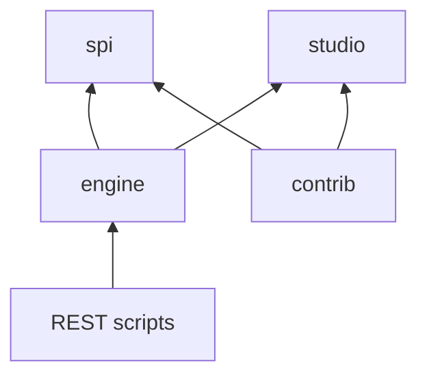
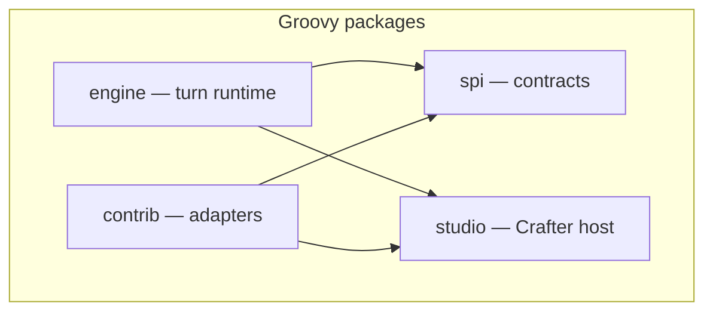
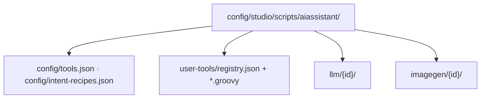

# Groovy package architecture (`spi` / `engine` / `contrib` / `studio`)

Maintainers: server-side Groovy under  
`authoring/scripts/classes/plugins/org/craftercms/aiassistant/`  
is organized so **engine** (turn runtime), **contrib** (pluggable adapters), **spi** (contracts), and **studio** (Crafter host) are obvious. REST scripts stay thin delegates under `authoring/scripts/rest/…` and are not part of this tree.

**Repackage automation:** `scripts/repackage-ai-assistant-groovy.py` (moves + import rewrites).

## Dependency rule

- **engine** must not import concrete builtin tool classes (only registry/manifest).
- **contrib** implements **spi** and calls **studio**.
- **studio** does not depend on **engine** or **contrib**.

## Layout

### `spi/`

| Path | Role |
|------|------|
| `spi/tool/` | `StudioAiOrchestrationTool`, `StudioAiToolContext`, tool helpers |
| `spi/llm/` | `StudioAiLlmRuntime`, `StudioAiLlmKind`, `StudioAiRuntimeBuildRequest` |
| `spi/imagegen/` | `StudioAiImageGenerator`, `StudioAiImageGenContext` |

### `engine/`

| Path | Role |
|------|------|
| `engine/turn/` | `AiOrchestration`, tools loop, SSE, plan, chat-completions wire |
| `engine/routing/` | Intent routing facade (`Router`); subrouting: `AuthoringIntentRecipeRouter`, `AuthoringTurnGoal`, `AuthoringIntentRoutingEngine`, `AuthoringIntentRecipeEngine`, catalog/plan helpers |
| `engine/catalog/` | Per-request tool list assembly (`AiOrchestrationTools#build` → `StudioAiToolRegistry`), translate subgraph helpers, LLM/image resolvers |
| `engine/policy/` | Tools-loop wire policy |
| `engine/prompt/` | Tool prompt loading and overrides |
| `engine/rag/` | Plugin instruction RAG + expert skills vectors |
| `engine/autonomous/` | Scheduled assistants |
| `engine/context/` | `AuthoringPreviewContext`, `SiteProjectContext` |
| `engine/util/` | `ParallelToolExecutor`, `ContentSubgraphAggregator` |

Bundled default recipes: `engine/routing/authoring-intent-recipes-default.json`.

### `contrib/`

| Path | Role |
|------|------|
| `contrib/tool/builtin/cms/` | CMS tools (`GetContent`, `WriteContent`, `GenerateImage`, translate tools, …) |
| `contrib/tool/builtin/general/` | `GenerateTextNoTools`, `QueryExpertGuidance` |
| `contrib/tool/builtin/cms/internal/` | Shared CMS helpers (former `tools/cms/support`) |
| `contrib/tool/builtin/integrations/` | Slack, web search, CrafterQ, … |
| `contrib/tool/builtin/http/` | HTTP fetch/post helpers |
| `contrib/tool/builtin/development/` | Template / playbook tools |
| `contrib/tool/builtin/site/` | `InvokeSiteUserTool`, `StudioAiUserSiteTools` (site `user-tools/`) |
| `contrib/tool/mcp/` | MCP client + wire tools |
| `contrib/llm/wire/openaispec/` | **OpenAISpec** tools-loop wire (`OpenAiSpecSpringAiLlmRuntime`) — **not** the OpenAI vendor folder |
| `contrib/llm/vendor/anthropic/` | Claude / Anthropic — **`AnthropicSpringAiLlmRuntime`**, **`StudioAiAnthropicSimpleCompletion`** (auxiliary `/v1/messages`), 429 retry client config |
| `contrib/llm/script/` | Site script LLM loader |
| `contrib/imagegen/` | Script image backends |
| `contrib/agents/` | Central agents catalog merge |

**OpenAI vs OpenAISpec:** The **OpenAI** vendor is `StudioAiLlmKind.OPENAI_NATIVE` (`openAI`). **OpenAISpec** is the chat/tools HTTP shape implemented by `contrib/llm/wire/openaispec/` and shared by several vendors (OpenAI, xAI, deepSeek, llama, gemini).

### `studio/`

| Path | Role |
|------|------|
| `studio/repository/` | `StudioToolOperations` |
| `studio/config/` | `StudioAiAssistantProjectConfig`, site module text |
| `studio/secrets/` | Secrets service + catalog + macro resolver |
| `secrets/` | `StudioAiAssistantSecretsContext` (request-scoped bind; not moved with service types) |
| `studio/http/` | `AiHttpProxy` |

## Site sandbox (not in the JAR)

Per-site extensions live in git, loaded by **contrib** loaders:

## Related docs

- [chat-and-tools-runtime.md](chat-and-tools-runtime.md) — tools loop, MCP, RAG
- [intent-recipe-routing.md](intent-recipe-routing.md) — `engine/routing`
- [llm-configuration.md](../using-and-extending/llm-configuration.md) — vendors vs OpenAISpec wire
