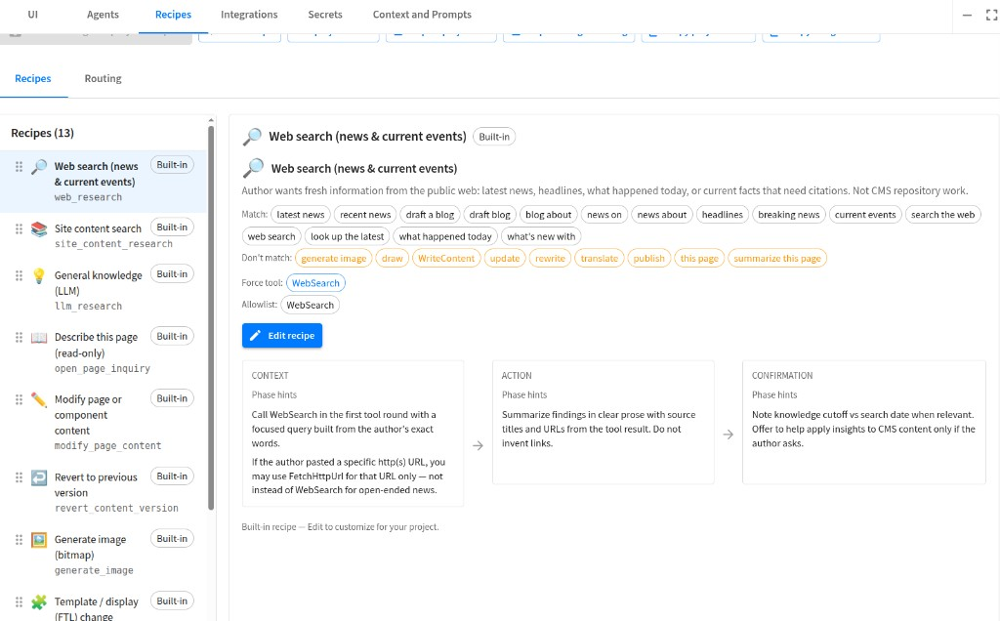

# Building intent recipes

**Canonical guide:** Cursor project skill **[`.cursor/skills/building-intent-recipes/`](../../.cursor/skills/building-intent-recipes/)**

| File | Contents |
|------|----------|
| [SKILL.md](../../.cursor/skills/building-intent-recipes/SKILL.md) | Agent-oriented workflow: fields, capabilities, checklist, troubleshooting |
| [examples.md](../../.cursor/skills/building-intent-recipes/examples.md) | Full **project-management** initiative → Slack example (`recipe_propose_initiative_slack`) |

Enable the **building-intent-recipes** skill in Cursor when authoring or debugging site `intent-recipes.json`.

**Also see:**

- [configuration-guide.md §9.0](configuration-guide.md#cg-9-0) — admin UI and routing flags
- [configuration-guide — Recipes tab screenshot](configuration-guide.md#cg-screenshots) — built-in catalog, match hints, and phase hints in Project Tools:

- [intent-recipe-routing.md](../internals/intent-recipe-routing.md) — runtime pipeline (maintainers)
- [CURSOR_PROJECT_POLICY.md](../CURSOR_PROJECT_POLICY.md) — index of project skills and rules
