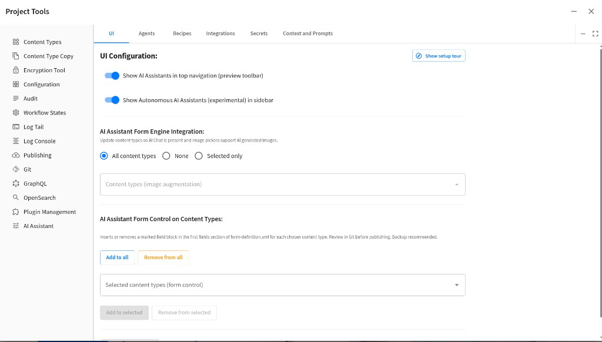
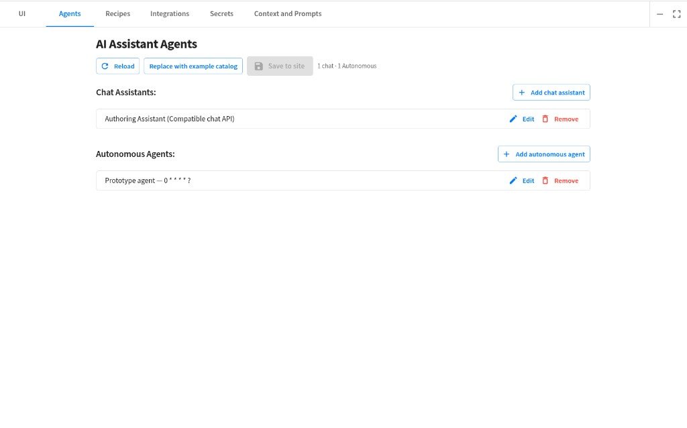
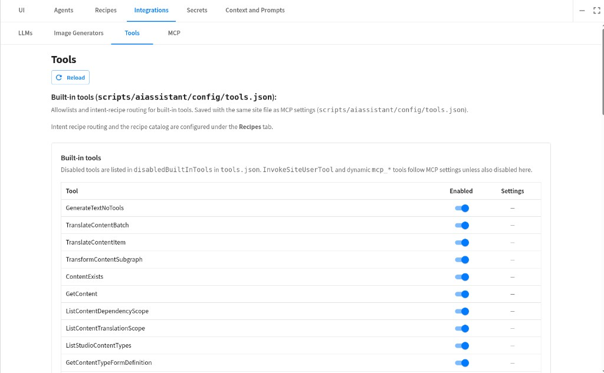

# Configuration Guide — AI Assistant for Crafter Studio

**Audience:** **Crafter Studio admins** responsible for installing and configuring the assistant and its **tools** for authors—`ui.xml` widget placement, **`agents.json`**, credentials, form wiring, optional TinyMCE, and optional site-script overrides.

## Table of Contents

**[Basic Configuration](#cg-basic)** — `ui.xml` widget placement + **`agents.json`**: Helper / Tools Panel / Preview / Autonomous, **`plugin`** line, secrets, form pipeline, checklist; TinyMCE last (**§8**) within **§1–§8**.

| § | Topic |
|---|--------|
| [1](#cg-1) | What you are configuring — goals; [where XML goes](#cg-1-xml) ([A](#cg-1a) Preview toolbar · [B](#cg-1b) Tools Panel · [C](#cg-1c) Form · [D](#cg-1d) Autonomous · [E](#cg-1e) Studio UI flags) |
| [2](#cg-2) | Helper / Autonomous / toolbar — **`plugin`** element |
| [3](#cg-3) | Agents (`config/studio/ai-assistant/agents.json`) |
| [4](#cg-4) | Secrets and API keys |
| [4b](#cg-joyride) | Configuration tour (first visit + replay) |
| [5](#cg-5) | Form Engine control |
| [6](#cg-6) | Autonomous assistants (overview) |
| [7](#cg-7) | Checklist before support |
| [8](#cg-8) | TinyMCE (rich text editor) |

**[Advanced Configuration](#cg-adv)** — Site Git scripts under `config/studio/scripts/aiassistant/…`: Markdown prompts, **`tools.json`**, user tools, script image backends, script LLMs, MCP.

| § | Topic |
|---|--------|
| [9.0](#cg-9-0) | Intent recipes (**Recipes** tab) |
| [9.1](#cg-9-1) | Override tool / system prompt text (`prompts/*.md`) |
| [9.2](#cg-9-2) | Enable / disable stock (built‑in) tools |
| [9.3](#cg-9-3) | Scripted tools, script LLMs, image generators |
| [9.4](#cg-9-4) | MCP servers (optional remote tools) |

**[Related Documentation](#cg-related)** — Cross-links to **spec.md**, LLM guide, studio plugins guide, scripted tools, runtime doc, advanced overrides, and **Screenshots**.

**[Where to Go Next](#cg-10)** — Links to [llm-configuration.md](llm-configuration.md), [spec.md](../internals/spec.md), and the rest of this doc set.

**[Screenshots](#cg-screenshots)** — Project Tools entry and **AI Assistant Configuration** dialog (all tabs).

**[Diagrams](#cg-diagrams)** — Administrator setup flow, configuration model, Project Tools tab map, author surfaces.

---

<a id="cg-diagrams"></a>

## Diagrams

Visual guides for administrators and authors (Mermaid). Full set: **[Architecture & diagrams](../architecture-diagrams.md)**.

| Diagram | Link |
|---------|------|
| What to configure and where files live | [Configuration model](../architecture-diagrams.md#configuration-model-design) |
| Recommended setup order | [Administrator setup workflow](../architecture-diagrams.md#administrator-setup-workflow) |
| Project Tools tabs → repo paths | [Project Tools configuration map](../architecture-diagrams.md#project-tools-configuration-map) |
| Where authors open chat | [Author experience](../architecture-diagrams.md#author-experience-user) |

---

<a id="cg-screenshots"></a>

## Screenshots — Project Tools and AI Assistant Configuration

These screenshots show **Project Tools** (where you install the plugin and open **AI Assistant**) and the tabbed **AI Assistant Configuration** dialog. Paths below are relative to this file (`docs/using-and-extending/`).

**Note:** PNG files under `docs/images/ai-assistant-studio/` may not be checked into this repository; capture them locally after install if links 404. Current tabs are **UI**, **Agents**, **Recipes**, **Integrations** (LLMs / Image generators / Tools / MCP), **Secrets**, and **Prompts and Context** (older docs called some of these **Tools and MCP** / **Scripts**).

### Project Tools (Sidebar)


*Use **Plugin Management → Search & install** for the marketplace flow; open **AI Assistant** for configuration after install.*

### AI Assistant Configuration — UI Tab



*Toolbar/sidebar toggles, Experience Builder image augmentation scope, and bulk add/remove of the form-engine AI Assistant field.*

### Agents Tab



*Chat assistants vs autonomous agents; reload, example catalog, and save to site.*

### Edit Agent


*Provider, model, image generator, built-in tools checklist, and optional quick-prompt chips.*

### Integrations → Tools (and MCP sub-tab)



*Under **Integrations → Tools**: built-in tool visibility and user-tools registry. **Integrations → MCP** holds the MCP client toggle and server rows.*

<a id="cg-screenshots-mcp-github"></a>

#### GitHub MCP (example in Project Tools)


*Example **`mcpServers`** row: server id **`Github`**, URL **`https://api.githubcopilot.com/mcp/`**, **`Authorization`** header (use a real token in production; never commit tokens to the repo), **`readTimeoutMs`** **120000**. Same settings persist to **`config/studio/scripts/aiassistant/config/tools.json`** when you click **Save tools & MCP**. Match URL and headers to GitHub’s current **[Remote GitHub MCP Server](https://github.com/github/github-mcp-server/blob/main/docs/remote-server.md)** documentation.*

### Integrations → LLMs / Image generators


***Integrations → LLMs** and **Image generators** edit script backends under `config/studio/scripts/aiassistant/llm/` and `…/imagegen/`.*

---

<a id="cg-basic"></a>

## Basic Configuration

Typical authoring setup is **`config/studio/ui.xml`** (widget placement) plus **`config/studio/ai-assistant/agents.json`** (agents) and content-type form definitions: register the Helper (and optional Autonomous), use one consistent **`plugin`** line, configure agents in **Project Tools → AI Assistant → Agents**, supply keys, run the checklist (**§1–§7**), then optionally wire **TinyMCE** (**§8**). **§1–§8** below are the subsections in reading order.

---

<a id="cg-1"></a>

### 1. What You Are Configuring

| Goal | Typical touchpoints |
|------|---------------------|
| Authors use AI **in Experience Builder** while authoring in **preview** | `ui.xml` → **`craftercms.components.aiassistant.Helper`** + agents in **`agents.json`** — optional toolbar icon visibility via **`studio-ui.json`** (**§1e**) |
| Authors use AI on a **content type form** | Content type **form definition** → **AI Assistant** control + chat agents in **`agents.json`** (per-agent visibility toggles on the form field) |
| **Scheduled** server-side runs (experimental) | `ui.xml` → **`craftercms.components.aiassistant.AutonomousAssistants`** + **`agents.json`** rows with **`mode: autonomous`** — see [spec.md — Autonomous assistants widget](../internals/spec.md#autonomous-assistants-widget-tools-panel); optional **sidebar show** via **`studio-ui.json`** (**§1e**); default off. |
| Authors use AI from the **rich text editor** (optional) | `config/studio/ui.xml` → **TinyMCE** widget → `tinymceOptions` (external plugin URL + `craftercms_aiassistant` JSON) — **§8** (last) and [tinymce-integration.md](tinymce-integration.md) |

Commit **`config/studio/ui.xml`** (and any content-type changes) to the site sandbox so Studio and other authors load the same configuration.

<a id="cg-1-xml"></a>

### Where to Put XML (File + Parent Elements)

| What | File on disk (site Git sandbox) | Where inside the file |
|------|-----------------------------------|------------------------|
| **Helper** (Experience Builder toolbar, optional Tools Panel) | **`config/studio/ui.xml`** | **A** (Preview toolbar) and/or **B** (Tools Panel) — the `<widget id="craftercms.components.aiassistant.Helper">` block is a **child of an existing `widgets` list**, not a loose sibling of `ToolsPanel`. |
| **Form assistant** | **`config/studio/content-types/<your-type>/form-definition.xml`** | New **field** inside the right **`<section>`** / **`<fields>`** — prefer adding the **Studio AI Assistant** control from the Content Types UI after install (see **C**). |
| **Autonomous** (optional) | **`config/studio/ui.xml`** | **D** — under **`craftercms.components.ToolsPanel`** → **`configuration`** → **`widgets`** (same list as Helper when both are used). Optional **hide** without removing the widget: **`studio-ui.json`** (**§1e**). |
| **TinyMCE** (optional) | **`config/studio/ui.xml`** | Under **`craftercms.components.TinyMCE`** → **`configuration`** → **`setups`** → **`setup`** → **`tinymceOptions`** (JSON). See **§8** (last in basic sequence). |

---

<a id="cg-1a"></a>

#### A) Experience Builder — Preview Toolbar

**Locate in `config/studio/ui.xml`:** the widget **`craftercms.components.PreviewToolbar`** → **`configuration`** → **`rightSection`** or **`middleSection`** → **`widgets`** (descriptor-driven install uses **`rightSection`**; use **`middleSection`** if you want the icon next to the URL bar).

**Add** the block below as **another** `<widget>` sibling next to the other toolbar widgets (indentation may differ in your file):

```xml
        <!-- config/studio/ui.xml — PreviewToolbar / configuration / rightSection or middleSection / widgets -->
        <widget id="craftercms.components.aiassistant.Helper">
          <plugin id="org.craftercms.aiassistant.studio" type="aiassistant" name="components" file="index.js"/>
          <configuration ui="IconButton"/>
        </widget>
```

Longer copy-paste blocks (Tools Panel + Preview + Autonomous together): [examples/studio-ui-aiassistant-fragments.xml](../examples/studio-ui-aiassistant-fragments.xml).

---

<a id="cg-1b"></a>

#### B) Studio Tools Panel (Left Rail)

**Locate:** **`craftercms.components.ToolsPanel`** → **`configuration`** → **`widgets`**.

**Add** the Helper (and optionally **Autonomous**) as `<widget>` children **inside that `widgets` element** — not after `</configuration>` at the wrong level.

```xml
        <!-- config/studio/ui.xml — ToolsPanel / configuration / widgets -->
        <widget id="craftercms.components.aiassistant.Helper">
          <plugin id="org.craftercms.aiassistant.studio" type="aiassistant" name="components" file="index.js"/>
          <configuration/>
        </widget>
```

---

<a id="cg-1c"></a>

#### C) Content Type Form (AI Assistant Field)

**Locate:** `config/studio/content-types/<content-type-id>/form-definition.xml` — inside the **`<fields>`** collection for the section where you want the accordion.

**Recommended:** In Studio, **Project Tools → Content Types →** open the type → **Add field** → choose **Studio AI Assistant** from the palette (the plugin registers that control in **`config/studio/administration/site-config-tools.xml`** on install). That writes the correct control wiring; hand-editing is easy to get wrong.

Chat agents come from **`config/studio/ai-assistant/agents.json`** (Project Tools → AI Assistant → Agents). The form control exposes per-agent visibility toggles for agents defined there.

---

<a id="cg-1d"></a>

#### D) Autonomous Assistants (Tools Panel Only)

**Locate:** same parent as **B** — **`craftercms.components.ToolsPanel`** → **`configuration`** → **`widgets`**.

**Add** a **second** widget sibling (after or before Helper). Minimal shape:

```xml
        <!-- config/studio/ui.xml — ToolsPanel / configuration / widgets -->
        <widget id="craftercms.components.aiassistant.AutonomousAssistants">
          <plugin id="org.craftercms.aiassistant.studio" type="aiassistant" name="components" file="index.js"/>
          <configuration>
            <title>Autonomous Agents</title>
          </configuration>
        </widget>
```

Full sample (including optional SVG icon): [examples/studio-ui-aiassistant-fragments.xml](../examples/studio-ui-aiassistant-fragments.xml).

---

<a id="cg-1e"></a>

#### E) Studio UI Flags & Bulk Tools (`studio-ui.json` + Project Tools)

**File:** **`config/studio/scripts/aiassistant/config/studio-ui.json`** (module **`studio`**). Authors usually create or edit it from **Project Tools → AI Assistant** → **UI** tab (`craftercms.components.aiassistant.ProjectToolsConfiguration`); you can also commit the JSON by hand in the site sandbox. The Project Tools save uses **`write_configuration`** with **`content`** set to **`JSON.stringify(...)`** — the Studio v2 API expects a **string** body for this endpoint, not a raw JSON object.

**Why it exists:** Lets admins **hide** specific surfaces or **scope** optional client-side behavior **without** deleting the merged **`ui.xml`** widget rows. The bundle reads this file via Studio **`get_configuration`** (sync XHR, per-site cache; invalidated when the Project Tools panel saves).

| Field | Meaning |
|-------|--------|
| **`showAiAssistantsInTopNavigation`** | When **`false`**, the Helper **`ui="IconButton"`** preview **toolbar** control does not render. **Tools Panel** Helper entries are **not** affected. Default **`true`** or omit. |
| **`showAutonomousAiAssistantsInSidebar`** | When **`true`**, the **`AutonomousAssistants`** sidebar widget renders (experimental). Default **`false`** or omit. |
| **`contentTypeImageAugmentationScope`** | **`all`** (default) — client patch augments **every** content type for Experience Builder **image-picker** drag targets when the AI **image-from-URL** datasource is referenced. **`none`** — no augmentation. **`selected`** — only ids in **`contentTypeIdsForImageAugmentation`**. |
| **`contentTypeIdsForImageAugmentation`** | String array of normalized ids (e.g. **`"/page/article"`**, **`"/component/hero"`**) used when scope is **`selected`**. |

**Bulk form control:** The same Project Tools screen can insert or remove a **marked** AI Assistant field block in **`config/studio/content-types/.../form-definition.xml`** (first **`sections` → `section` → `fields`** insertion point). Use **Add to all / Remove from all** or pick types then **Add to selected / Remove from selected**. Review diffs in Git before publishing; backup or branch first.

**REST (integrators):** Plugin script **`GET …/aiassistant/content-types/list?siteId=`** returns the Studio content-type catalog (via `StudioToolOperations.listStudioContentTypes`) for the multi-select UI.

**See also:** [Screenshots — Project Tools and AI Assistant Configuration](#cg-screenshots) · [spec.md — Studio UI flags](../internals/spec.md#studio-ui-flags-studio-uijson) · [helper-widget.md](helper-widget.md) · [autonomous-assistants-widget.md](autonomous-assistants-widget.md).

**Upgrades:** If your site still shows **three** separate AI Assistant rows under Project Tools (from an older plugin descriptor), remove the legacy **`<tool>`** entries in **`config/studio/administration/site-config-tools.xml`** (or via Studio’s project tools UI) so only **AI Assistant** (`ai-assistant-config`) remains—each legacy widget id still loads the same tabbed panel with the correct default tab until you do.

---

<a id="cg-2"></a>

### 2. Helper, Autonomous, and Toolbar Widgets: `plugin` Element

Studio resolves the **JavaScript bundle** from the **`plugin`** child on each widget that mounts this plugin (Helper, AutonomousAssistants, and any **Experience Builder preview toolbar** entry that uses the same pattern). Use the same values everywhere so Studio loads **`index.js`** from the installed plugin.

| Attribute / concept | Use this value |
|------------------------|----------------|
| **`id`** (plugin id) | `org.craftercms.aiassistant.studio` — must match **`craftercms-plugin.yaml`** and the plugin’s internal **`PluginDescriptor.id`**. |
| **`type`** | `aiassistant` |
| **`name`** | `components` |
| **`file`** | `index.js` |

Example **`plugin`** line (use **inside** every Helper / Autonomous / toolbar widget — see **§1** for parent paths):

```xml
<plugin id="org.craftercms.aiassistant.studio" type="aiassistant" name="components" file="index.js"/>
```

Full **Experience Builder + Tools Panel + Autonomous** examples: [examples/studio-ui-aiassistant-fragments.xml](../examples/studio-ui-aiassistant-fragments.xml).

If the id or `file` path is wrong, Studio shows **component not found** or **404** on `index.js`. Install path, classpath, and toolbar wiring are covered in [studio-plugins-guide.md](studio-plugins-guide.md); widget XML contract in [spec.md § Helper widget](../internals/spec.md#helper-widget-studio-ui).

---

<a id="cg-3"></a>

### 3. Agents (`config/studio/ai-assistant/agents.json`)

Configure chat and autonomous agents in **Project Tools → AI Assistant → Agents**. Saving writes **`config/studio/ai-assistant/agents.json`**. The Helper menu, form-engine accordion, preview ICE panel, and server stream merge all read this file.

Each **chat** row (`mode: chat` or omitted) is one Helper picker entry (and one form accordion row when enabled on the field). Typical fields:

- **`label`** — Display name.
- **`agentId`** — System-generated UUID for the row (read-only in Project Tools). Sent as **`agentId`** on stream/chat; do not change after go-live.
- **`llm`** — **`openAI`**, **`claude`**, **`xAI`**, **`deepSeek`**, **`llama`**, **`gemini`**, or **`script:{id}`**. Unsupported hosted-only values (**`aiassistant`**, **`hostedchat`**, …) return **HTTP 400**.
- **`llmModel`**, **`imageModel`**, **`imageGenerator`**, **`enableTools`**, **`enabledBuiltInTools`**, **`prompts`**, **`skills`** (per-agent markdown URLs), etc.
- **`llmSecretKey`** (optional) — In Project Tools, pick a row from **Secrets** for this agent: the built-in slot for the agent’s current **`llm`** provider, or a **custom** secret key. When set, runtime resolves that entry from **`secrets.json`** instead of only the provider default row. Omit to use the provider’s default secret row.

**Autonomous** rows use **`mode: autonomous`** with **`name`**, **`schedule`**, **`prompt`**, **`scope`**, and the same LLM fields.

Field reference: [spec.md — Central agent catalog](../internals/spec.md) · [llm-configuration.md](llm-configuration.md). Use **Reload example catalog** in Project Tools for a starter file.

---

<a id="cg-4"></a>

### 4. Secrets and API Keys (Recommended Order)

1. **Project Tools → Secrets** — Site registry at **`config/studio/scripts/aiassistant/config/secrets.json`**. On first open (or **`scripts/install-plugin.sh`** when the file is missing), the plugin seeds one row per built-in LLM provider **and** optional integration rows (e.g. **`serpapi_api_key`**) with **`${env:VAR_NAME}`** defaults authors can change. Store **`${env:…}`**, Crafter **`${enc:…}`** ciphertext (from Studio **Encrypt Marked**), or plain text (encrypted on save). Resolved values are used **only on the server**; the UI never receives decrypted literals after save.
2. **Runtime resolution** — Tools and LLM code read **only what is stored** in **`secrets.json`** for that key (no silent catalog default if a row is missing). **`${env:VAR}`** expands via the Studio JVM environment; **`${enc:…}`** decrypts via Crafter **`textEncryptor`** on Studio 4.x. LLM providers may still fall back to host env / JVM properties **after** secrets resolution when the provider stack allows it — see [llm-configuration.md](llm-configuration.md). Integration tools such as **`SerpApiWebSearch`** use **secrets only** (no separate env bypass).
3. **JVM system properties** — Advanced tuning and key fallbacks only; see **[studio-aiassistant-jvm-parameters.md](studio-aiassistant-jvm-parameters.md)**.
4. **Per‑agent `llmSecretKey` in `agents.json`** — Optional; references a **custom** key in **`secrets.json`** or the built-in provider row for the agent’s **`llm`** (Project Tools → Agents).
5. **Per‑agent `llmApiKey` in `agents.json` or POST body** — **testing only**; discouraged in Git‑tracked sites.

**Do not commit plaintext secrets** — prefer **`${env:…}`** on the Studio host or **`${enc:…}`** in **`secrets.json`**. MCP **`headers`** and other config strings may also use **`${secret:key}`** to reference an entry in **`secrets.json`**. In **Integrations → MCP**, use the **Auth secret (custom)** control to bind a header to **`${secret:yourKey}`** without pasting the raw token in Git.

---

<a id="cg-joyride"></a>

### 4b. Configuration Tour (Joyride)

On first open of **Project Tools → AI Assistant** on a **site** for a **new plugin version**, a short welcome dialog offers **Show me around**. The tour highlights **Secrets → UI → Agents → Integrations** with speech bubbles anchored to each tab. Authors can **Skip tour** anytime, click the dimmed backdrop (**Dismiss tour**), or press **Escape** (popover close).

- **Replay:** **UI** tab → **Show setup tour** (does not reset “seen” for auto-popup on version bump until you finish or skip again).
- **Version storage:** Browser **`localStorage`** per site: `org.craftercms.aiassistant.joyride.seenVersion.<siteId>` (value aligned with plugin version in `sources/src/aiAssistantPluginVersion.ts`). Each Crafter site gets its own first-run tour; upgrading the plugin version re-offers the tour on every site until dismissed again.

Maintainers: step copy in `sources/src/aiAssistantJoyrideSteps.ts`; routing logic in `sources/src/AiAssistantJoyride.tsx`.

---

<a id="cg-5"></a>

### 5. Form Engine Control

The AI Assistant **form control** lists chat agents from **`agents.json`** (same catalog as the Helper). Per-agent **show in panel** toggles live on the content-type field definition. See [studio-plugins-guide.md](studio-plugins-guide.md) (**Form assistant panel**) and [spec.md](../internals/spec.md) (content-type form assistant).

---

<a id="cg-6"></a>

### 6. Autonomous Assistants (Optional)

Separate **AutonomousAssistants** widget in **`ui.xml`** (placement only). Agent definitions are **`mode: autonomous`** rows in **`agents.json`**. See [spec.md — Autonomous assistants widget](../internals/spec.md#autonomous-assistants-widget-tools-panel).

---

<a id="cg-7"></a>

### 7. Checklist Before Opening a Support Thread

- [ ] Plugin installed for the **site** (Marketplace or `copy-plugin` / `install-plugin.sh`); **`org.craftercms.aiassistant.studio`** appears in Plugin Management.
- [ ] **`ui.xml`** committed; Studio **Sync** performed if you rely on git‑backed sandbox.
- [ ] Helper / Autonomous / toolbar widgets are **nested under the correct parents** in **`config/studio/ui.xml`** (**§1** A / B / D), and the **`plugin`** line matches **§2**.
- [ ] **`config/studio/ai-assistant/agents.json`** saved with at least one chat agent (Project Tools → Agents).
- [ ] **Secrets** tab: **`secrets.json`** configured (env macros and/or encrypted values) for LLM providers you use.
- [ ] For **OpenAI‑wire / Claude / …**: host **env** vars referenced from **Secrets**, or testing‑only **`llmApiKey`** on an agent row.
- [ ] For **GenerateImage**: **`imageModel`** set on the agent (or body) when that tool is used.
- [ ] **`llm`** is a **supported** provider (**`openAI`**, **`claude`**, **`script:{id}`**, …).

---

<a id="cg-8"></a>

### 8. TinyMCE (Rich Text Editor)

**File:** **`config/studio/ui.xml`**

**Locate:** widget **`craftercms.components.TinyMCE`** → **`configuration`** → **`setups`** → **`setup`** (the setup your site uses) → **`tinymceOptions`**. That node holds JSON (often as text); merge the plugin URL and toolbar ids there.

Path in the tree (names may differ):

```text
config/studio/ui.xml
  └── widget[@id='craftercms.components.TinyMCE']
        └── configuration
              └── setups
                    └── setup
                          └── tinymceOptions   ← merge here (JSON)
```

**Example JSON** (replace **`YOUR_SITE_ID`**; use **`&amp;`** for `&` when this JSON is inlined inside an XML attribute):

```json
{
  "toolbar1": "... | aiAssistantOpen aiassistantShortcuts",
  "external_plugins": {
    "craftercms_aiassistant": "/studio/1/plugin/file?siteId=YOUR_SITE_ID&pluginId=org.craftercms.aiassistant.studio&type=aiassistant&name=tinymce&file=craftercms_aiassistant.js"
  },
  "craftercms_aiassistant": {}
}
```

Full toolbar list and keys: [tinymce-integration.md](tinymce-integration.md).

---

<a id="cg-adv"></a><a id="cg-9"></a>

## Advanced Configuration (Prompts, Tools, Scripts, MCP)

All paths in this section are under the **site** Git sandbox (`config/studio/scripts/aiassistant/…`). Commit changes and refresh Studio configuration as you do for other site scripts.

<a id="cg-9-0"></a>

### 9.0 Intent Recipes (Recipes Tab)

**Studio:** **Project Tools → AI Assistant → Recipes**.

**What it configures:**

| Artifact | Path (default) | Role |
|----------|----------------|------|
| Recipe catalog | `config/studio/scripts/aiassistant/intent-recipes.json` | Named authoring flows (bundled defaults + site overrides) |
| Routing policy | `config/studio/scripts/aiassistant/config/tools.json` → **`intentRecipeRouting`** | Enable/disable routing, custom catalog path, eligibility / JSON router flags |

**Save behavior:** **Save** on the Recipes tab writes **both** the recipes JSON and the **`tools.json`** routing block (so routing flags stay in sync with the catalog editor).

**Integrations → Tools** shows built-in tool allow/deny only; it does **not** host the recipe catalog editor.

**Recipe row fields (site catalog):**

| Field | Role |
|-------|------|
| **`phases.context` / `action` / `confirmation`** | Author-facing bullets in the matched-recipe prelude (Context / Action / Confirmation). |
| **`matchedUserPrelude`** | Extra Studio block prepended when the recipe matches. |
| **`toolsLoopForceTool`**, **`toolsLoopAllowlist`**, **`toolsLoopExcludeTools`** | Tools-loop policy for this recipe (e.g. force **`SerpApiWebSearch`** on round 0). |
| **`toolsLoopMaxFetchHttpUrlCalls`**, **`toolsLoopFetchHttpUrlWireMaxChars`** | Caps for web-research + fetch workflows. |

**Phase hint templates** (expanded on the server when the prelude is built):

| Token | Meaning |
|-------|---------|
| `{{studio.today}}` | Today’s date (Studio JVM, server time zone). |
| `{{studio.today-7D}}` | Calendar date 7 days before today (`D` / `W` / `M` units). |
| `{{studio.now}}` | Current date and time. |
| `{{studio.now-2H}}` | Date/time minus offset (`H`, `D`, `W`, `M`). |
| `{{initial.binding.field}}` / `{{current.binding.field}}` | Prefetch artifact snapshots after recipe-engine steps. |

Example Context line: *Today's date: **{{studio.today}}**. Only sources on or after **{{studio.today-7D}}**.*

**Maintainer reference:** [intent-recipe-routing.md](../internals/intent-recipe-routing.md) (pipeline, telemetry, bundled `authoring-intent-recipes-default.json`).

---

<a id="cg-9-1"></a>

### 9.1 Override Tool / System Prompt Text

**Put Markdown here:**

```text
config/studio/scripts/aiassistant/prompts/<KEY>.md
```

**`<KEY>`** is the exact **prompt key** passed to `ToolPrompts.p('KEY', …)` (listed in `ToolPromptsOverrideCatalog.KEYS`). Files use a **purpose prefix**: **`GENERAL_`** (LLM / native-tools policy and other cross-cutting Studio text), **`CMS_CONTENT_`** (repository content, translate, preview, publish), **`CMS_DEVELOPMENT_`** (templates, content types, analyze). The file on disk is **`<KEY>.md`**.

| Example `<KEY>.md` |
|--------------------|
| `GENERAL_LLM_AUTHORING_INSTRUCTIONS.md` |
| `CMS_CONTENT_DESC_GET_CONTENT.md` |
| `GENERAL_LLM_CHAT_ONLY_SYSTEM.md` |

| Rule | Detail |
|------|--------|
| **Replace vs merge** | The file **replaces the entire** built‑in string for that key. There is no partial patch. |
| **Blank file** | Treated like **missing** — the shipped default stays. |
| **Order** | Site file is read **before** classpath defaults when a chat request runs (`ToolPromptsLoader`). |

**Finding keys:** Search **`ToolPrompts.groovy`** in this plugin repo for `p('SOME_KEY',` — the first argument is the filename stem (`SOME_KEY.md`). The canonical list is **`ToolPromptsOverrideCatalog.groovy`** (`KEYS`).

**Overlap (`GENERAL_LLM_AUTHORING_INSTRUCTIONS` vs `GENERAL_LLM_USER_MESSAGE_TOOLS_POLICY_PREFIX`):** The large **system** prompt holds full workflow and edge cases. The shorter **user-prefix** repeats the highest-signal plan/tool rules because many models weight the start of the user message heavily. When editing overrides, change **both** only if you need the same wording in both places; otherwise adjust the system file for detail and the user-prefix file for “above the fold” reminders.

**Example — tighten the main authoring system prompt** (file on disk: `config/studio/scripts/aiassistant/prompts/GENERAL_LLM_AUTHORING_INSTRUCTIONS.md`):

```markdown
## OUR STUDIO POLICY (override)

You are assisting CrafterCMS authors. Use tools when they are on the wire. Prefer small, verifiable edits.
(…your full replacement text; this file replaces the entire shipped default for this key…)
```

---

<a id="cg-9-2"></a>

### 9.2 Enable / Disable Stock (Built‑In) Tools

You can maintain **`tools.json`** in Git or use **Project Tools → AI Assistant → Integrations → Tools** (built-in allow/deny; intent recipe **routing flags** are on the **Recipes** tab). **Integrations → MCP** edits **`mcpEnabled`** / **`mcpServers`**. **`user-tools/registry.json`** and Groovy tools share the **Tools** sub-tab.

**Put JSON here:**

```text
config/studio/scripts/aiassistant/config/tools.json
```

| Field | Effect |
|-------|--------|
| **`disabledBuiltInTools`** | JSON array of **tool names to hide** (compared case‑insensitively). Example: `["GenerateImage", "FetchHttpUrl"]` removes those tools from the catalog. |
| **`enabledBuiltInTools`** | If this array is **non‑empty**, it is a **whitelist** of **built‑in** tool wire names to **keep**; every other built‑in is removed **except** **`InvokeSiteUserTool`** and any **`mcp_*`** tools (unless those appear in **`disabledBuiltInTools`** / **`disabledMcpTools`**). Names must match the registered tool string **exactly** (case‑sensitive). If **omitted** or **empty**, all built‑ins are available minus **`disabledBuiltInTools`**. |
| **`builtInToolSettings`** | Per–built-in tool options (not enable/disable). **`SerpApiWebSearch.defaults`** holds Google/SerpAPI params (`engine`, `gl`, `hl`, **`tbs`** for date range such as **`qdr:w`** past week, etc.). Configure **`serpapi_api_key`** on **Secrets** only — missing or unresolved key fails the tool call; Studio does not hide the wire or substitute another search tool. |
| **`disabledUserTools`** | JSON array of site user tool ids (from **`user-tools/registry.json`**) to hide from **`InvokeSiteUserTool`** while keeping registry rows. |
| **`pluginRag`** | Bundled instruction RAG before the tools loop (**`mode`**: **`off`** default, **`supplement`**, **`replace`**; sliders for kernel size, retrieval **topK**, appendix/chunk limits). |
| **`agentSkillsRag`** | Limits for per-agent markdown **skills** (**`QueryExpertGuidance`**): max enabled skills per request, embedding model, chunk caps. |

**Studio UI:** **Project Tools → Agents** → open an agent → **Site orchestration (tools.json)** — RAG sliders and built-in tool toggles. Intent recipe routing remains on the **Recipes** tab.

**Example — plugin RAG off (default), agent skills limits explicit:**

```json
{
  "pluginRag": {
    "mode": "off",
    "kernelMaxChars": 5200,
    "topK": 8,
    "maxAppendChars": 14000,
    "maxChunkChars": 1800,
    "maxChunks": 400,
    "embedBatchSize": 64
  },
  "agentSkillsRag": {
    "maxSkills": 12,
    "embeddingModel": "text-embedding-3-small",
    "maxChunks": 400,
    "maxChunkChars": 1800
  }
}
```

**Registered built-in wire names** — use these strings verbatim in **`disabledBuiltInTools`**, **`enabledBuiltInTools`**, and **`omitTools`**. Canonical UI list: **`sources/src/studioAiOrchestrationToolIds.ts`** (`STUDIO_AI_BUILTIN_TOOL_IDS`); server registration in **`AiOrchestrationTools.groovy`**. When MCP is enabled, the server also registers dynamic **`mcp_<serverId>_<toolName>`** tools (sanitized); those are not listed here.

| Wire name (PascalCase) |
|------------------------|
| `FetchHttpUrl` |
| `GenerateImage` |
| `GenerateTextNoTools` |
| `GetContent` |
| `GetContentSubgraph` |
| `GetContentTypeFormDefinition` |
| `GetContentVersionHistory` |
| `GetCrafterizingPlaybook` |
| `GetPreviewHtml` |
| `InvokeSiteUserTool` |
| `ListContentTranslationScope` |
| `ListPagesAndComponents` |
| `ListStudioContentTypes` |
| `QueryExpertGuidance` |
| `ResearchSiteContent` |
| `TransformContentSubgraph` |
| `TranslateContentBatch` |
| `TranslateContentItem` |
| `WebSearch` |
| `SerpApiWebSearch` |
| `WriteContent` |

| Wire name (snake_case) |
|------------------------|
| `analyze_template` |
| `publish_content` |
| `revert_change` |
| `update_content` |
| `update_content_type` |
| `update_template` |

Per-request **`omitTools`** / agent **`<enableTools>false</enableTools>`** still apply on top of this file.

**Example — SerpAPI instead of DuckDuckGo (`WebSearch`):**

```json
{
  "disabledBuiltInTools": ["WebSearch"],
  "builtInToolSettings": {
    "SerpApiWebSearch": {
      "defaults": {
        "engine": "google",
        "googleDomain": "google.com",
        "gl": "us",
        "hl": "en",
        "location": "United States",
        "num": 10,
        "device": "desktop",
        "safe": "active",
        "tbs": "qdr:w"
      }
    }
  }
}
```

Enable **`SerpApiWebSearch`** in **tools.json** (not in **`disabledBuiltInTools`**). Set **`serpapi_api_key`** in **Secrets** (`${env:SERPAPI_API_KEY}` or **`${enc:…}`**). Point intent recipes at **`SerpApiWebSearch`** (`toolsLoopForceTool`, **`toolsLoopAllowlist`**, phase hints) — Studio does **not** substitute another search wire if the forced tool is disabled or missing from the wire.

When **`toolsLoopForceTool`** is set but that tool is not registered, the tools loop returns a **Recipe tool unavailable** message instead of guessing. Web-research recipes may set **`toolsLoopMaxFetchHttpUrlCalls`** (default **3** when the allowlist is search + **`FetchHttpUrl` only**) so the server stops extra **`FetchHttpUrl`** calls after the cap and rejects duplicate URLs in the same turn.

**Example — hide image + outbound fetch, keep the rest:**

```json
{
  "disabledBuiltInTools": ["GenerateImage", "FetchHttpUrl"]
}
```

**Example — whitelist only read + list tools** (exact names; everything else built‑in is removed except **`InvokeSiteUserTool`** / **`mcp_*`** unless also disabled):

```json
{
  "enabledBuiltInTools": [
    "GetContent",
    "ListContentTranslationScope",
    "ListStudioContentTypes",
    "GetContentTypeFormDefinition",
    "ListPagesAndComponents",
    "GetPreviewHtml"
  ]
}
```

---

<a id="cg-9-3"></a>

### 9.3 Scripted Tools, Script LLMs, and Image Generators

| What | Where you put it | How the model uses it |
|------|------------------|------------------------|
| **Site user tools** (Groovy) | **`config/studio/scripts/aiassistant/user-tools/`** + **`registry.json`** | Model calls **`InvokeSiteUserTool`** with **`toolId`** matching an entry in **`registry.json`**; script name on disk must match **`script`** / **`file`**. |
| **Script LLM** | **`config/studio/scripts/aiassistant/llm/{id}/runtime.groovy`** (or `llm.groovy`) | Agent **`<llm>script:{id}</llm>`** — see [llm-configuration.md](llm-configuration.md) and [studio-plugins-guide.md](studio-plugins-guide.md). |
| **Script image backend** | **`config/studio/scripts/aiassistant/imagegen/{id}/generate.groovy`** | Agent or POST **`imageGenerator`** = **`script:{id}`**. **`none`** / **`off`** / **`disabled`** removes **GenerateImage**. Blank + keys + **`imageModel`** uses the default **built-in Images HTTP** wire (same **`/v1/images/generations`** shape as the chat tools-loop client stack). |

Copy‑paste starter: **`docs/examples/aiassistant-user-tools/`**; **Gemini “Nano Banana 2” image script:** **`docs/examples/aiassistant-imagegen/nano-banana-2/generate.groovy`**. **Interfaces, bindings, return maps, and setup checklists** (integrators): **[scripted-tools-and-imagegen.md](scripted-tools-and-imagegen.md)**. When **`GenerateImage`** uses the default HTTP wire vs **`script:{id}`**: [image-generation.md](image-generation.md). Build / classpath / security: [studio-plugins-guide.md](studio-plugins-guide.md) (**user-tools**, **imagegen**, **tools.json**).

**Example — `registry.json` + Groovy file** (same folder: `config/studio/scripts/aiassistant/user-tools/`):

`registry.json`:

```json
{
  "tools": [
    {
      "id": "hello",
      "script": "hello.groovy",
      "description": "Returns a greeting; optional args.name"
    }
  ]
}
```

`hello.groovy` (same directory):

```groovy
[ok: true, message: "Hello ${(args?.name ?: 'author') as String} from ${siteId}"]
```

**Example — script image backend on an agent** (in **`agents.json`** on the same row as **`imageModel`**):

```json
"imageModel": "gpt-image-1-mini",
"imageGenerator": "script:mygen"
```

Implement **`config/studio/scripts/aiassistant/imagegen/mygen/generate.groovy`** per **[scripted-tools-and-imagegen.md](scripted-tools-and-imagegen.md)** (closure contract, **`context`** map) and [image-generation.md](image-generation.md) (registration rules).

**Example — script LLM agent** (in **`agents.json`**):

```json
"llm": "script:mybackend"
```

Implement **`config/studio/scripts/aiassistant/llm/mybackend/runtime.groovy`** per [llm-configuration.md](llm-configuration.md).

---

<a id="cg-9-4"></a>

### 9.4 MCP Servers (Optional Remote Tools)

Same file: **`config/studio/scripts/aiassistant/config/tools.json`**.

**Studio (Project Tools):** **Integrations → MCP**. When **MCP** is enabled and you save with at least one complete server row, Studio calls each server’s **`tools/list`**, opens a checklist so you can **enable or disable** individual **`mcp_*`** wire tools when tools are returned; if none are returned, the same dialog still lists **server status** (errors or empty catalogs) and you can **Save** to persist the rest of **`tools.json`** unchanged. Use **List MCP tools** anytime for a **read-only** preview without saving. Per-server **Auth secret (custom)** maps a header to **`${secret:key}`** from **`secrets.json`** (see **§4**).

| Field | Purpose |
|-------|---------|
| **`mcpEnabled`** | Must be JSON **`true`** or **`mcpServers`** is **ignored** (default off). |
| **`mcpServers`** | Array of `{ "id": "…", "url": "https://host/…/mcp", "headers": { }, "readTimeoutMs": 120000 }` — **Streamable HTTP** MCP endpoint (`POST` on **`url`**). |
| **`disabledMcpTools`** | Optional array of **wire** tool names to hide, e.g. **`mcp_docs_search`**. You can also list MCP wire names under **`disabledBuiltInTools`**. |

Each MCP tool becomes a function named roughly **`mcp_<serverId>_<toolName>`** (sanitized, length‑capped). SSRF rules match **`FetchHttpUrl`**. In **`mcpServers[].headers`**, each value may use **`${env:VARIABLE_NAME}`** (Studio JVM env) or **`${secret:key}`** ( **`secrets.json`** entry). Unset env → empty string before the MCP call.

**Example:**

```json
{
  "mcpEnabled": true,
  "mcpServers": [
    {
      "id": "docs",
      "url": "https://mcp.example.com/mcp",
      "headers": { "Authorization": "Bearer ${env:GITHUB_MCP_TOKEN}" },
      "readTimeoutMs": 120000
    }
  ],
  "disabledMcpTools": ["mcp_docs_search"]
}
```

For a hosted **Streamable HTTP** reference (base URL, `/readonly` paths, optional `X-MCP-*` headers, and JSON snippets), see GitHub’s **[Remote GitHub MCP Server](https://github.com/github/github-mcp-server/blob/main/docs/remote-server.md)** — map each recipe’s URL and headers into an `mcpServers[]` row (`id`, `url`, `headers`, optional `readTimeoutMs`) in Project Tools or in Git. **UI example (GitHub Copilot MCP endpoint):** [Screenshots — GitHub MCP](#cg-screenshots-mcp-github).

Full behavior, lifecycle, and limits: [chat-and-tools-runtime.md § MCP client tools](../internals/chat-and-tools-runtime.md#mcp-client-tools-streamable-http). JVM caps / host allowlists: [studio-aiassistant-jvm-parameters.md](studio-aiassistant-jvm-parameters.md).

---

<a id="cg-10"></a>

## 10. Where to Go Next

| Topic | Document |
|-------|-----------|
| Full `<llm>` matrix, env + XML, tool availability | [llm-configuration.md](llm-configuration.md) |
| **`InvokeSiteUserTool`** + **`script:{id}`** image Groovy (integrators; bindings, examples) | [scripted-tools-and-imagegen.md](scripted-tools-and-imagegen.md) |
| Build, install, classpath, `user-tools/`, script LLM | [studio-plugins-guide.md](studio-plugins-guide.md) |
| Macros, `omitTools`, ICE vs form engine, REST paths, human tasks | [spec.md](../internals/spec.md) |
| SSE / stream endpoint design | [stream-endpoint-design.md](../internals/stream-endpoint-design.md) |
| Intent recipe routing (maintainer) | [intent-recipe-routing.md](../internals/intent-recipe-routing.md) |
| Doc map (internals vs using) | [README.md](../README.md) |

---

<a id="cg-related"></a>

### Related Documentation

**[spec.md](../internals/spec.md)** — requirements and mechanics for surfaces, `ui.xml`, form vs preview, macros, autonomous REST, **`secrets.json`**. **[llm-configuration.md](llm-configuration.md)** — **`<llm>`** wire ids, env + XML, **`llmSecretKey`**, tool availability by provider. **[studio-plugins-guide.md](studio-plugins-guide.md)** — install, build output paths, Project Tools tabs, **`user-tools/`**, script LLM layout. **[intent-recipe-routing.md](../internals/intent-recipe-routing.md)** — pre-tools recipe pipeline (**§9.0** admin summary). **[scripted-tools-and-imagegen.md](scripted-tools-and-imagegen.md)** — Groovy **`InvokeSiteUserTool`** / **`script:{id}`** image backends (this guide **§9.3**). **[chat-and-tools-runtime.md](../internals/chat-and-tools-runtime.md)** — REST POST bodies, MCP, SSE/tool-progress hints, troubleshooting. **[Advanced configuration](#cg-adv)** — site overrides (recipes, prompts, built-in tool policy, scripted tools, image backends, MCP). **[Configuration tour](#cg-joyride)** · **[Screenshots](#cg-screenshots)**.
